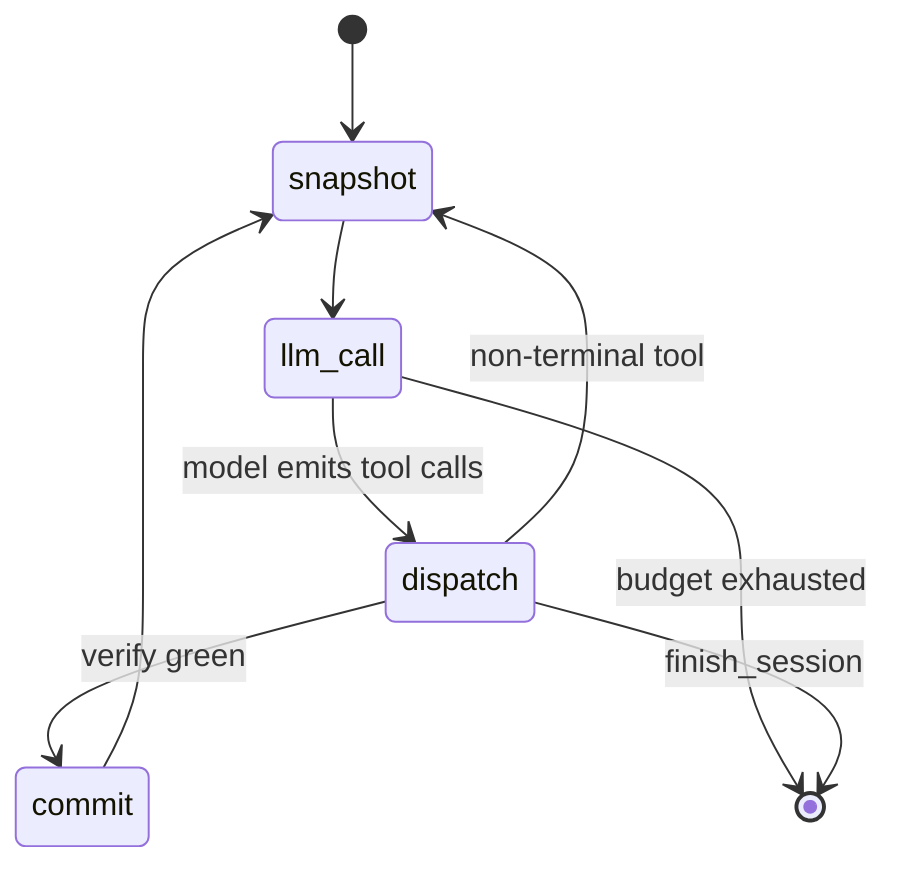
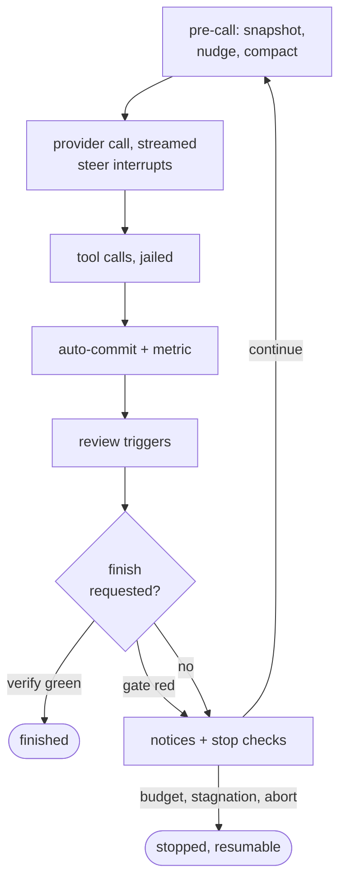
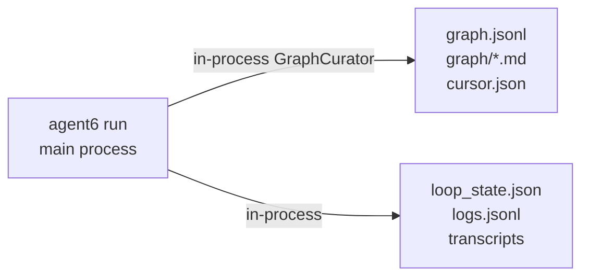

# Architecture

How agent6 runs, end to end.
The diagrams are built from the current source at site-build time (`docs/gen_diagrams.py`), except the one flow chart marked as drawn by hand.
[security.md](security.md) covers the threat model and what each isolation level enforces; [AGENTS.md](https://github.com/agent6-dev/agent6/blob/master/AGENTS.md) covers per-file conventions and stability rules.

## Layering

The engine stack is `ui -> app -> workflows -> tools -> sandbox`.
An edge is "imports from"; a dashed edge would mark an import climbing the stack.
[tach](https://docs.gauge.sh/) records the map ([tach.toml](https://github.com/agent6-dev/agent6/blob/master/tach.toml)); workflows never import each other, and the engine never imports the UI.

<!-- diagram: layering -->

Any layer may also use the shared substrate: <!-- generated: substrate-names -->.

- **ui** ([src/agent6/ui/](https://github.com/agent6-dev/agent6/tree/master/src/agent6/ui)): the presentation layer and composition root.
  The four front-ends (`ui/cli`, `ui/tui`, `ui/web`, `ui/acp`), `ui/mcp_server.py` (agent6 as an MCP server), and the write helpers `ui/spawn` and `ui/notify`, over the shared read-model fold (`viewmodel`).
- **app** ([src/agent6/app/](https://github.com/agent6-dev/agent6/tree/master/src/agent6/app)): the pipelines composed over the engine: run/resume/fork/machine-agent lifecycles, merge and finalize, provider construction, the sandbox cross-checks (`app.confine`), the `--parallel` fan-out
    - never imports `agent6.ui`
    - what it cannot do itself (own a terminal, render, spawn detached) arrives as frozen injected callables (`SessionFrontend`, `LaneRuntime`); output goes through the injected `Reporter`
- **workflows** ([src/agent6/workflows/](https://github.com/agent6-dev/agent6/tree/master/src/agent6/workflows)): `loop` (the agent loop behind `agent6 run` and `resume`) and `review` (the read-only pass behind `agent6 review`).
  The single-turn `code_review` call shape lives here too; the agent loop makes its own provider calls inline.
- **tools** ([src/agent6/tools/](https://github.com/agent6-dev/agent6/tree/master/src/agent6/tools)): the fixed tool surface the LLM sees, plus dispatch.
- **sandbox** ([src/agent6/sandbox/](https://github.com/agent6-dev/agent6/tree/master/src/agent6/sandbox)): the `agent6-jail` launcher and its policy.
  The jail bounds commands, one launcher per run; the agent process itself is never confined.

**Where the CLI resolves things.** `ui/cli` parses arguments, optionally spawns the TUI, and picks a workflow.

- `cli_main` is the one error boundary: `OperatorError` (with `ConfigError`, `MemoryStoreError`) prints an `ERROR:` refusal at exit 2; anything else crash-reports with a saved traceback at exit 1
- config resolves through [config/layer.py](https://github.com/agent6-dev/agent6/blob/master/src/agent6/config/layer.py) (defaults, global, per-repo, `--config FILE`); paths and sudo/root through [paths.py](https://github.com/agent6-dev/agent6/blob/master/src/agent6/paths.py); keys through [secrets.py](https://github.com/agent6-dev/agent6/blob/master/src/agent6/secrets.py)
- per-repo state lives out of the workspace at `$XDG_STATE_HOME/agent6/<repo-id>/`, keyed on the nearest enclosing `.git` (a subdirectory reaches the same runs, memory, config); the base moves with `[agent6].state_dir` or `AGENT6_STATE_HOME`
- every config edit goes through [config/write.py](https://github.com/agent6-dev/agent6/blob/master/src/agent6/config/write.py): one lock-held validate + revalidate + rollback cycle, or "kept as written" when the fail-open lock was not held

Three model roles route independently: `worker` drives `run` and `resume`, `planner` drives `plan`, `reviewer` drives `review` and the in-loop panel.
Unset roles fall back to `worker`.

## A run

One provider, one model, one message history.

- the model drives by calling tools; the workflow dispatches, snapshots, tracks budget
- multi-step work is the next tool call in the same conversation: no planner-to-worker handoff, no separate reviewer by default
- the in-loop review panel is opt-in (`[review]`), layered on the same history

Drawn by hand against `workflows/loop.py`'s drive tier, the same turn with its decisions:

**Snapshot before every call.** `loop_state.json` is rewritten in the session directory before each provider request, with a per-turn copy under `checkpoints/<NNNN>.json`.
`agent6 resume` rehydrates from `loop_state.json` and `agent6 fork --at-turn N` from the matching checkpoint.
With the per-tool transcripts, an interrupted run replays deterministically up to the next model call.

**Per-step commits** fire when `run_verify_command` returns 0, through `git_ops.py` outside the jail, onto the run's detached chain (`refs/agent6/<id>/head`, temp-index staged).

- `branch_per_run` also advances a visible `agent6/<id>` branch
- HEAD, the index, and the checkout never move: mid-run git activity cannot collide with the record
- consolidation is chosen at `sessions merge` time (`git.merge_strategy`: `squash`, `merge`, `ff`)

**The task DAG is scaffolding.** `add_task` / `update_task` / `list_tasks` write a curator-owned side store with `depends_on` edges, cycle-checked; they do not pick the next tool.

- each turn the current task surfaces into the prompt (the cursor's open subtask, else the first dependency-satisfied pending one), advances as tasks pass, marks `in_progress`
- `finish_session` refuses while the worker's own subtasks are open, capped so an unclosable task cannot stall the run
- the surfaced banner survives tier-1 elision and re-injects after each tier-2 restart
- a focus task held without forward motion draws a split/pass/skip nudge, re-firing up to a small cap; progress resets it

**Standing tasks park a run instead of ending it.** A standing task (`run --standing "<goal>"`, `add_task(standing=true)`) is the never-passing fallback, worked only when no ordinary subtask is ready.

- the model retires its own (`skipped`/`obsolete`); the operator's `--standing` goal only the operator retires
- while one exists, the soft out-of-work endings (`finish_session`, the settled family, a quiet turn) convert into re-entry
- faults, operator verbs, the iteration cap, and a spent budget still end the run
- a re-entry round landing no executed tool call escalates the nudge; `[workflow].standing_patience` bounds the streak (`-1` default: never self-ends; landed work resets)
- an interactive run parks the same way on a quiet turn: the conversation waits on the steer bridge; any composer or the pause menu continues it in place

**Context compaction has two tiers**, thresholds in `[context]`.

- tier 1, `drop_at_chars`: the oldest tool results become placeholders naming the elided call; reads of recently-edited files elide last
- a large `read_file` decays in two stages: a model-written gist first, the bare marker under continued pressure (oldest gists first); files changing under edits are never gisted
- tier 2, `summarise_at_chars`: the elided history is summarised by the `reviewer` model; the conversation restarts from task + summary
- the DAG survives the restart: the current task re-surfaces, the summariser reports finished/new tasks (finished marked `passed`, new queued)
- compaction is visible: events carry the elisions and the restart summary, every view marks them in place, `/status` shows counts
- `/compact [focus]` compacts on demand; `/pin <text>` survives every restart verbatim (4000-char total cap, loud refusal over it) and persists in the snapshot

**Repo memory**: one fact per markdown file under `<state-dir>/<repo-id>/memory/`, plus a one-line-per-entry `MEMORY.md` index.
Beside it, `DECISIONS.md` holds the operator's rulings: the harness appends every `ask_user` answer and every steer that answered a question, verbatim with its question, session and time; the model reads it first (a `<decisions>` block, re-shown after a compaction restart), never writes it (`agent6 memory decisions` prints it), and a finish-time check reports any ruling missing from the file.

- the index injects into every run's prompt as a capped `<memory>` block; depth is a file read
- the worker writes through the ordinary edit tools under a narrow grant, in-process only; the jail never mounts it
- run mode writes; plan and ask read; machine modes see none
- models never write unprompted (46 bench legs: zero writes), so the loop surfaces the mechanism twice: an advisory when verify first recovers green, and a once-deferred `finish_session` after such a recovery with nothing recorded
- `agent6 memory add/list/show/rm` is the operator surface over the same files

**Skills** resolve at run start from `<data-dir>/skills/` plus `[skills].extra_dirs`, through one resolution: the `<skills>` index and what `use_skill` serves cannot diverge.

- `always` skills inject full text; the rest get an index line and load on demand; run mode only
- delivery is measured: small models never call `use_skill` from the index alone; the reliable paths are `always`, `/name`, and `run --skill`

**`finish_session(summary)`** is the only terminal tool: it emits a `session.end` event and returns control to the CLI.

## The run lifecycle

`app/run.py`'s `run_task` composes one stage per step, drawn in the order it calls them: refusals and clamps, isolation, git preflight, manifest, provider and tool assembly, gate inference, the loop, then auto-merge and the end report.
The stash finalize is last because it runs from `finally`, on every exit path, refusals included.

<!-- diagram: run-lifecycle -->

## Tool dispatch

Every LLM tool call passes the same gates: audit events wrap it, the mode backstop refuses an out-of-surface name, MCP calls take an approval, and the handler table routes the rest by name.
Commands and verify run jailed; file tools resolve through the workspace boundary.

<!-- diagram: tool-dispatch -->

The table routes <!-- generated: tool-names -->.

## A review

A single read-only pass ([workflows/review.py](https://github.com/agent6-dev/agent6/blob/master/src/agent6/workflows/review.py)) over a diff: the working tree, a branch against a base, or an arbitrary range.
It produces structured findings, and makes no edits, no commits, and no `run_command`.

## Parallel runs

Three consumers drive one primitive, a task run as a subordinate isolated run whose branch joins back: `run --parallel`, the web and TUI composers' `/parallel` new-work directive, and a live run's `/parallel` steer.
`agent6 sessions compare` is not one of them: it only ranks finished runs, and never clones, imports, or joins.

All three share one grammar in [directive.py](https://github.com/agent6-dev/agent6/blob/master/src/agent6/directive.py), a pure-stdlib leaf both `workflows` and `ui` import: `/parallel [spec] <task>`, repeatable, where `spec` is an optional lane count or model list and `parse_spec` maps it to one model per lane.
A segment's first token counts as a spec when it contains a comma or a slash, since model ids are provider/model shaped.
A bare name like `opus` stays task text, and a task whose first word is a path parses as a bogus model spec, so start a task with a verb.

Before any clone, a spec's models are checked against what a lane can run.

- lanes inherit the worker provider and override only the model: the universe is the worker's model plus that provider's cached listing ([models/validate.py](https://github.com/agent6-dev/agent6/blob/master/src/agent6/models/validate.py))
- unknown model: refuses early with a did-you-mean where a cache exists; proceeds with a warning where none does (offline machines never block on a regenerable cache)
- all three consumers validate through the one helper, keeping `workflows` free of a models dependency

The primitive is git plumbing in [subrun.py](https://github.com/agent6-dev/agent6/blob/master/src/agent6/workflows/subrun.py), with no LLM, no UI, and no process spawning:

- `clone_workspace(origin, dest)`: a plain `git clone` of a disposable lane workspace.
- `import_run(origin, lane_repo, branch, lane_session_dir, origin_state)`: fetches the lane's branch into the origin and moves its session dir under `<origin_state>/sessions/runs/`, refusing to overwrite an existing branch or session dir.
- `LaneSpawner` / `GroupLaneSpawner`: the Protocols for dispatching one lane, or a sibling group, and awaiting completion.

[app/parallel.py](https://github.com/agent6-dev/agent6/blob/master/src/agent6/app/parallel.py) implements those Protocols and is the only module that knows how to run a lane.
The detached spawn it drives (`ui.spawn`, the path `attach` and `resume` use) is injected as a `LaneRuntime` by the CLI adapter `ui/cli/parallel.py`, and liveness and stop requests go to the run-dir bridge (`sessions.ipc`).

**`agent6 run --parallel N|model-a,model-b`** plans one `LaneSpec` per lane, each spawned as an ordinary detached `agent6 run` with its own jail and `run_commands` policy.

- each lane's live session dir symlinks into `<origin_state>/sessions/runs/` on locate: a fan-out is visible in every hub while it runs
- on completion a lane imports and the symlink becomes the real directory; a failed-to-start, still-running, or refused lane keeps its clone and symlink (never the only copy lost)
- imported candidates auto-compare into a ranked report with `sessions merge <id>` lines: a structured judge ([judge.py](https://github.com/agent6-dev/agent6/blob/master/src/agent6/workflows/judge.py)) where a reviewer model exists, else verify-then-cost
- the compare stamps each lane's manifest (`compare`, one writer): every view shows placement and why; listings star the winner
- nothing merges automatically
- `--max-usd` is per lane and caps the judge like one more lane; the `$X/lane x N + judge = $Y total` line prints before spawning

**A `/parallel` steer dispatches a sibling group** through `Workflow.lane_spawner` (the injection point keeping `workflows` from importing `ui`; `run.py`/`resume.py` wire the real spawner, run mode only).

- the loop blocks with no provider calls while lanes run: chain-commit the worktree first (lanes cut from the chain tip), expand segments, clone/spawn/await/import, merge each branch onto the chain in dispatch order (`chain_merge` syncs merged files into the worktree)
- each segment gets one DAG node: `passed` with the last joined sha, or `failed` when every lane failed or conflicted; a conflict aborts that merge and tells the model; the run continues either way
- `loop.parallel.dispatched` / `joined` / `failed` render as conversation markers: the blocked wait is visible, never silent

**Depth is 1.** Every spawned lane carries `AGENT6_SUBRUN=1`, and both `--parallel` and `build_coordinator_spawner` refuse to wire a `lane_spawner` when it is set.

## Enforcement layering

- `git_ops.py` runs outside the jail, in the agent's own process, so the read-only bind of `.git` stops the worker without stopping the workflow's commits.
- `protect_git` is strict-only: strict read-only bind-remounts `.git` over the workspace mount
    - hardened has no mount namespace to carve: blanket read-write on the cwd, `.git` writable by jailed commands
    - carving it there would also deny new top-level entries (`target/`, `.pytest_cache/`)
    - the writable `.git` is gated by `run_commands` (default `ask`), recoverable via branch-per-run + `git_ops`, bounded by the container
- Run state is out of reach of jailed commands because it lives outside the workspace, at `<state-dir>/<repo-id>/`, unreachable from the repo cwd.

[security.md](security.md) states which guarantee each layer provides.

## The curator and its locks

An in-process `GraphCurator` (`graph/curator.py`) owns the task graph; the agent constructs one per run, and the worker, planner, and alignment-guard roles mutate through it.
The same process writes the rest of the run state.
Every mutation validates against a pydantic schema before it applies.

One curator per run is an invariant (two live curators cache independently; the second write drops the first's parent-child links).

- `run`/`resume`/`fork` take a single-writer flock on `<run-dir>/worker.lock`; a second process refuses
- a crashed writer releases on death: resume-after-crash never blocks
- a per-mutation flock on the session dir guards concurrent operator-CLI reads/writes
- a write-path fault after the in-memory update reloads from disk before surfacing: no read ever observes an unpersisted node

One live run-mode worker per checkout is the level above (`sessions/lock.py`, a repo-wide flock on `<state-dir>/repo.lock`): run-mode workers share one working tree, so a second would interleave two runs' edits into each other's chain commits.
A second `agent6 run` parks: the submitted task is saved verbatim in the new run's manifest (`parked_task`, with `parked_reason`, shown as "parked · checkout busy" in listings) and `agent6 resume <id>` starts it once the checkout is free; the message also offers a `/parallel 1 <task>` steer that hands it to the live run as an isolated lane.
Plan and ask expose no edit tools and spawn freely; `--parallel` lanes work in isolated workdirs under the coordinator's one lock.

The working tree at start is the run's next gate, in the same shape.
Files that are untracked then are the operator's: the run records them (`untracked-at-start`) and neither commits them nor counts them as dirt.
Uncommitted changes to tracked files are asked about over the `ask_user` channel (stash for the run, include them in its commits, or cancel, which parks the run with `parked_reason` "uncommitted changes"); `[git].auto_stash` and `require_clean_worktree = false` answer without asking, and a run nobody can answer refuses before its dir exists.

## Session state on disk

Each session directory is `<state-dir>/<repo-id>/sessions/<bucket>/<session-id>/`, where the bucket is the mode plus `s`: `runs/`, `plans/`, `asks/`, and `machines/` for `machine create` authoring.
Ids are one namespace across every bucket, since every surface addresses a session by bare id, so minting and an explicit `--session-id` both refuse an id any bucket holds.

| File | Holds |
|---|---|
| `graph.jsonl` | append-only journal of every task-graph mutation (curator-owned) |
| `graph/*.md` | one markdown file per task node, rewritten atomically (curator-owned) |
| `logs.jsonl` | the structured event stream |
| `loop_state.json` | the latest resume snapshot, written before each LLM call and at iteration end |
| `checkpoints/<NNNN>.json` | per-turn snapshots at the pre-call boundary, carrying the workspace `head_sha` and curator `graph_version` |
| `plan.md` | the plan itself, in plan sessions |
| `transcripts/` | full provider request and response pairs for replay |
| `untracked-at-start` | the files untracked when the run started (repo-root-relative, NUL-separated): the operator's, left out of every chain commit and dirty check; a fork copies its source's |

`loop_state.json` is the latest pointer for resume; `checkpoints/` is the per-turn history `fork --at-turn` addresses, kept in full.
`finish_planning` is `plan.md`'s only writer and `agent6 plan edit` its only editor; the planner re-reads it before every turn and is shown it whenever it differs from what it last saw, so answers written there survive the next `finish_planning`.
`agent6 run --from-plan` feeds it as a new run's task.

**A fork** clones a source run's state as of a checkpoint into a new session dir with a new id.
It copies the checkpoint as the new `loop_state.json` and seed `checkpoints/0000.json`, rebuilds the curator DAG at the checkpoint's `graph_version`, writes a manifest with `parent_session_id` / `forked_from_turn` / `forked_from_sha`, and cuts `agent6/<new>` at the turn's sha.
The source run is never mutated, and one fork edge per line lands in a per-repo `lineage.jsonl`.

The rebuild (`graph/replay.py`) undoes every journal-stamped mutation newer than that version, so a fork's tasks, statuses, cursor, and journal match the turn its conversation came from.
Node content the journal never records (title, rationale, acceptance, paths) is immutable after creation and comes from the current nodes; `notes` and `updated_at` cannot be unwound and stay current.
A checkpoint with `graph_version: 0` has no version to rebuild at, so its fork copies the DAG verbatim.

A fork's tree is the repo as of that committed sha, nothing more.
On a gated run, an edit not yet committed at the forked turn is absent from the fork's tree even though the copied transcript mentions it, and the forked run picks it up by re-reading the real files.
A fork is a commit plus the conversation up to that turn, which is predictable and cheap, rather than snapshotting uncommitted bytes into every checkpoint.

## Events

One headless core feeds four front-ends: the CLI, the Textual TUI, the browser UI (`agent6 web`), and the ACP agent an editor drives.
All four fold the same event stream and render their own way.
Two shared layers sit under them: the read side [viewmodel/](https://github.com/agent6-dev/agent6/tree/master/src/agent6/viewmodel) (the `SessionState` and `MachineState` fold plus its wire form, exactly what `agent6 attach --json` and the web endpoints emit), and the write side, [ui/spawn.py](https://github.com/agent6-dev/agent6/blob/master/src/agent6/ui/spawn.py) for detached spawns and [sessions/ipc.py](https://github.com/agent6-dev/agent6/blob/master/src/agent6/sessions/ipc.py) for the approval, question, steer, and compact-request file contract the workflow polls.

The journal is durable by contract: an append failure on anything but the streaming deltas stops the run loudly (`EventWriteError`) rather than running on with an unrecordable outcome, and in-process listeners see an event only after its write landed.

The `logs.jsonl` vocabulary is small and stable, and is the data contract for any external viewer:

| Event | Notable fields |
| --- | --- |
| `session.start` | `user_task` |
| `tool.call` / `.result` | `name`, `args` (preview), `ok`, `summary`; a pair for every dispatched tool, including one a guard rejects (`ok=false` with the reason), so no call is unaccounted for. Execution tools also carry capped `stdout_tail` / `stderr_tail` |
| `verify.start` / `.end` | `cmd`, `exit_code`, `duration_s`, `*_tail` |
| `loop.decision.recorded` / `loop.decision.unrecorded` | an operator ruling appended to `memory/DECISIONS.md` (`question`, `answer`, clipped), or one the harness could not write / found missing at finish (`error` or `missing`) |
| `loop.verify_inferred` | `command` (argv, `[]` if none), `source` (`agents_md` / manifest / `llm` / `none` / `unadopted`), and `adopted_at` when a gateless run adopts one mid-run or drops an adopted gate that cannot run (`command: []`, `source: unadopted`) |
| `role.call` / `.result` | `role`, `model`, `tokens_in`, `tokens_out` |
| `role.text_delta` | streamed assistant text chunk |
| `role.thinking_delta` | streamed reasoning chunk |
| `session.steer_requested` | `source` (`"sigint"`): mid-run Ctrl-C |
| `budget.update` | totals and caps for input and output tokens |
| `approval.prompt` / `.answer` | `id`, `prompt`, `standing` / `id`, `approved`, `source` |
| `question.prompt` / `.answer` | `id`, `question`, `options` / `id`, `answer`, `source`: the `ask_user` tool and machine questioner states |
| `loop.*` | agent progress: `loop.auto_commit`, `loop.compact.*`, `loop.metric.*`, `loop.review.*`, `loop.steer.*` |
| `loop.budget` | per-iteration usage heartbeat, read by `agent6 sessions show` |
| `loop.review.*` | the panel: `start` (trigger, seats), `seat` (seat, model, verdict, findings), `panel` (blocked, decision, disarmed), `skipped`, and the finish gate's rejections |
| `session.end` | `reason`, `iterations`, `all_passed` (true = final tree observed verify-green, false = not green, null = nothing gated it); one shape from every exit path |

A `run_command` approval publishes as `approval.prompt`.

- the TUI's Allow/Deny writes the literal choice to `approvals/<id>.answer`; the workflow reads it before recording `approval.answer`
- the asking side decides what a choice grants: each prompt names its "allow all" scope (`command`, or one MCP server); standing answers record per scope; a no-standing gate sets `standing: false` and no front-end shows the button
- the answer poll falls back headless (stdin, or deny for a machine state) only after the front-end stays dead 30 consecutive seconds: a page reload or locked phone never converts a pending approval into a deny
- a watching browser registers as the run's answer front-end; prompts bridge to the page
- the task DAG is not in this stream: curator-owned `graph.jsonl`, read via `sessions graph`

## Where things live

| Concern | File or directory |
| --- | --- |
| Config schema | [config/model.py](https://github.com/agent6-dev/agent6/blob/master/src/agent6/config/model.py) |
| Tool surface | [tools/schema.py](https://github.com/agent6-dev/agent6/blob/master/src/agent6/tools/schema.py) |
| Tool dispatch | [tools/dispatch.py](https://github.com/agent6-dev/agent6/blob/master/src/agent6/tools/dispatch.py) |
| Agent loop | [workflows/loop.py](https://github.com/agent6-dev/agent6/blob/master/src/agent6/workflows/loop.py) |
| Prompt text | [prompts/](https://github.com/agent6-dev/agent6/tree/master/src/agent6/prompts) (pure strings the loop, review, judge, and machine assemble) |
| Review workflow | [workflows/review.py](https://github.com/agent6-dev/agent6/blob/master/src/agent6/workflows/review.py) |
| Code-review call shape | [workflows/code_review.py](https://github.com/agent6-dev/agent6/blob/master/src/agent6/workflows/code_review.py) |
| Jail launcher | [sandbox/jail.py](https://github.com/agent6-dev/agent6/blob/master/src/agent6/sandbox/jail.py) (Python), [jail/src/main.rs](https://github.com/agent6-dev/agent6/blob/master/src/agent6/jail/src/main.rs) (Rust) |
| Git policy | [git_ops.py](https://github.com/agent6-dev/agent6/blob/master/src/agent6/git_ops.py) |
| Subordinate-run primitive | [workflows/subrun.py](https://github.com/agent6-dev/agent6/blob/master/src/agent6/workflows/subrun.py) |
| Run-dir single-writer lock | [sessions/lock.py](https://github.com/agent6-dev/agent6/blob/master/src/agent6/sessions/lock.py) |
| Compare judge | [workflows/judge.py](https://github.com/agent6-dev/agent6/blob/master/src/agent6/workflows/judge.py) |
| Fan-out orchestrator | [app/parallel.py](https://github.com/agent6-dev/agent6/blob/master/src/agent6/app/parallel.py) (pipeline), [ui/cli/parallel.py](https://github.com/agent6-dev/agent6/blob/master/src/agent6/ui/cli/parallel.py) (CLI adapter) |
| Provider clients | [providers/](https://github.com/agent6-dev/agent6/tree/master/src/agent6/providers) |
| Task graph | [graph/](https://github.com/agent6-dev/agent6/tree/master/src/agent6/graph) |
| Event log and fold | [events.py](https://github.com/agent6-dev/agent6/blob/master/src/agent6/events.py) (writer), [viewmodel/](https://github.com/agent6-dev/agent6/tree/master/src/agent6/viewmodel) (fold) |
| Front-end write bridge | [ui/spawn.py](https://github.com/agent6-dev/agent6/blob/master/src/agent6/ui/spawn.py), [ui/notify.py](https://github.com/agent6-dev/agent6/blob/master/src/agent6/ui/notify.py), [sessions/ipc.py](https://github.com/agent6-dev/agent6/blob/master/src/agent6/sessions/ipc.py) |
| Web UI | [ui/web/](https://github.com/agent6-dev/agent6/tree/master/src/agent6/ui/web) (stdlib HTTP server and one embedded page) |
| Repo memory | [memory.py](https://github.com/agent6-dev/agent6/blob/master/src/agent6/memory.py) (store), `<state-dir>/<repo-id>/memory/` (data) |

## Bench and development switches

Five env vars exist for benchmark arms and harness experiments rather than product configuration, listed here so no behaviour keys off undocumented state:

- `AGENT6_SYMBOL_TOOLS`: selects a symbol-tool arm, hiding part of the navigation surface; a call to a hidden tool says so.
- `AGENT6_DISABLE_APPLY_EDIT=1`: withholds `apply_edit`, forcing the patch path; the refusal names the switch.
- `AGENT6_WENT_QUIET_MAX_NUDGES`: overrides the empty-turn nudge cap.
- `AGENT6_REASONING_EFFORT`: a default reasoning effort for OpenAI-compatible reasoning models, below any configured `[models.<role>].effort`.
- `AGENT6_FORCE_STREAM=1`: streams the run's reasoning to stderr with no TTY, for a bench or CI log.

## Pre-1.0 stability

Every public shape (config TOML, IPC frames, the on-disk graph, CLI flags, transcript layout) is liquid until 1.0, and breaks cleanly rather than carrying shims.
See [AGENTS.md](https://github.com/agent6-dev/agent6/blob/master/AGENTS.md).
