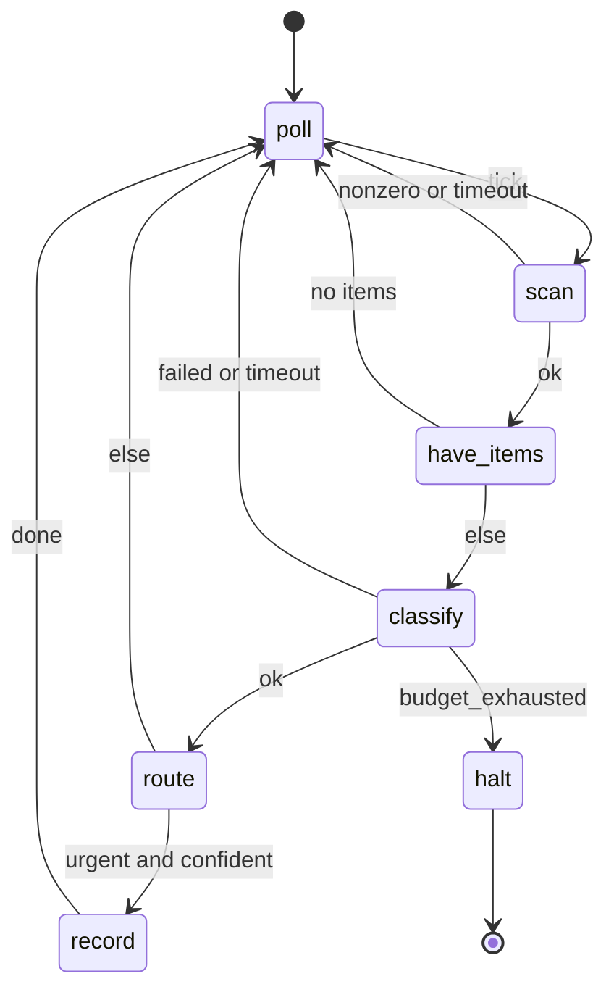

# Agent state machines

An agent state machine is a declarative, human-editable, machine-parseable program whose building blocks are agent6 runs, sandboxed tool calls, timed waits, and branches.
It lets an operator compose small deterministic agents that run for a long time, and agent6 is the runner.

This document specifies the format and its runtime.
The runtime lives under `src/agent6/machine/`, driven by the `agent6 machine` subcommands: `create`, `check`, `test`, `graph`, `run`, `status`, `poke`, `stop`, and `replay` ([CLI surface](#7-cli-surface)).
It changes neither the security model, the tool surface, nor the stability policy in [AGENTS.md](https://github.com/agent6-dev/agent6/blob/master/AGENTS.md); [Security considerations](#9-security-considerations) records how each invariant holds.

---

## 1. Motivation

`run` and `review` are single-shot.
A machine expresses the long-running shape: timed polling, branches on agent output, side-effecting steps, and terminal states.
Where "always-on" agents hand the LLM the *control flow* (so the same inputs take different paths and crashes lose state), here the operator authors the flow as a static graph and the LLM stays confined to the work *inside* a state: the deterministic snapshot-and-replay posture `run` already has internally, lifted one layer up.

---

## 2. Non-goals

- Not a general programming language
    - the branch/predicate grammar is non-Turing-complete: no loops inside a predicate, no arbitrary code
    - loops exist only as graph edges
- Not a distributed scheduler
    - one machine = one OS process (systemd / cron-friendly), restartable; no clustering in v1
- Not a new network surface
    - anything that talks to the outside world is a *tool*, gated by the existing audit rules
- Not LLM-authorized
    - `machine create` may draft a machine; in a repository `machine run` refuses the draft until the operator commits it

---

## 3. Design principles

- **Control flow is static and operator-owned; work is dynamic and model-owned**
    - the graph of states/edges is fixed at author time
    - inside an `agent` state runs the usual agent6 loop
- **Authored in a text editor**
    - TOML: diff-friendly, commentable
    - a state can *be* an agent6 run, so mini-agents are wired together rather than written in Python
- **Everything nondeterministic is journaled as a fact**
    - wall-clock reads, tool stdout, agent outputs: appended to an immutable event log the moment observed
    - the engine is a pure reducer over `(machine, blackboard, event) → blackboard'`
    - replay reads the journal instead of re-observing the world: a run backtests offline
- **Fail loudly** (repo convention)
    - one file parses to exactly one validated machine or a precise error
    - a missing transition target, an unreachable state, a blackboard type mismatch, an unknown key: load-time errors
- **No implicit defaults** (mirrors `Config`: `extra="forbid", frozen=True`)
    - every variable declares a type and an explicit initial value (`value` for `[vars.operator]`, `default` for mutable `[vars.code]`/`[vars.agent]`)
    - every state declares every outcome edge it can produce

---

## 4. The format

A machine is a single TOML file, suffix `.asm.toml` ("agent6 state machine").
TOML because the project already standardizes on it, `tomllib` parses it with no new dependency, and it is comfortable to hand-edit and diff.
The parsed document is validated by a pydantic v2 model at the trust boundary (`extra="forbid", frozen=True`), exactly like `Config`.

> **Naming.** The suffix `.asm.toml` ("agent state machine") is a convention, not a requirement: `load_machine` accepts any path, and shell completion globs `*.asm.toml`.

### 4.1 Top-level shape

```toml
machine = "item-classifier"                # stable id; names the instance dir
version = 1                                # schema version; bumped on changes
initial = "poll"                           # name of the entry state

[budget]
max_usd         = 25.0    # optional cap on metered spend (see below)
max_transitions = 100000  # hard stop on total edges taken (runaway guard)

# The blackboard is three subtables, named by who may write each variable.
# The subtable header is the owner; there is no per-entry discriminator.
[vars.operator]           # written at author time; immutable at runtime
inbox_dir = { type = "str", value = "/srv/inbox" }
poll_secs = { type = "int", value = 300 }

[vars.code]               # written deterministically by a tool state's capture
pending = { type = "list[str]", default = [] }
cursor  = { type = "str",       default = "" }

[vars.agent]              # written by an agent state's validated finish_session
verdict = { type = "classification", default = {} }  # a [schemas.*] record type

[schemas.<name>]          # named record types; see 4.6
...

[states.<name>]           # one table per state; see 4.3
...
```

### 4.2 The blackboard: three owners

The key/value store is split into three subtables, named by who may write each variable.
The subtable header carries the owner, so who may write a value is checkable at load time.

| subtable          | written by                                        | mutability        | declared with | example |
|-------------------|---------------------------------------------------|-------------------|---------------|---------|
| `[vars.operator]` | the human, at author time                         | immutable at runtime | `value`    | `inbox_dir`, `poll_secs`, thresholds, an API base |
| `[vars.code]`     | a `tool` state's `capture`                         | mutable (deterministic) | `default` | `pending`, `cursor` |
| `[vars.agent]`    | an `agent` state's validated `finish_session` payload | mutable (LLM)     | `default`     | `verdict` (a `[schemas.*]` record) |

Only `tool` states (into `[vars.code]`) and `agent` states (into `[vars.agent]`) ever mutate the blackboard; `branch`/`wait`/`terminal` only route, sleep, or end.

- **`[vars.operator]`**: the machine's parameters, set once at author/commit time, never written by any state
    - declared with a concrete `value` (not a `default`)
    - a `capture`/`set` targeting an operator var is a load-time error
    - any JSON-serializable value; the names above are illustrative
- **`[vars.code]`**: change only as a pure function of journaled tool output (what keeps the path deterministic and replayable)
- **`[vars.agent]`**: change only through the single validated structured output of one `agent` state (the LLM's one sanctioned channel into the blackboard)

`machine check` enforces the ownership wall.

- a `tool` capture targets only `[vars.code]`; an `agent` capture only `[vars.agent]`; `[vars.operator]` is read-only to every state
- a `tool` cannot smuggle a write into an LLM-owned variable; an agent cannot overwrite a deterministic one

Allowed types (all three subtables): `str`, `int`, `float`, `bool`, `list[<scalar>]`, `json`, and any **named record type** declared in `[schemas.*]` (see [Record schemas](#46-record-schemas-schemas)).
The two structured types differ on exactly one axis, **navigability**:

- `json` is an **opaque** blob: read or written wholesale only
    - passable to a tool/agent (`{{ x | json }}`) or captured whole, never dotted (`x.key` on `json` is a load-time error)
    - use it only when the machine never inspects the value's internals
- a **record type** (e.g. `classification`) is **navigable**
    - every `.field` read in a predicate or template checks against the schema at `machine check` time
    - a misspelled field is a load error, not a silent misroute

Declaring types up front is what makes branch predicates statically type-checkable: scalars by their declared type, record fields by their schema, and `json` forbidden from being dotted at all.

The blackboard (all three subtables) is the *only* state that flows between states.
The mutable halves (`[vars.code]` + `[vars.agent]`) are snapshotted to disk after every transition; `[vars.operator]` is fixed for the life of the machine.

### 4.3 State kinds

Every state has a `kind`.

| kind       | what it does                                              | outcome labels (edges)               |
|------------|-----------------------------------------------------------|--------------------------------------|
| `agent`    | runs one agent6 loop (a `Workflow`) on a prompt           | `ok` · `failed` · `budget_exhausted` · `timeout` |
| `tool`     | one sandboxed command via `run_in_jail`                   | `ok` · `nonzero` · `timeout`         |
| `wait`     | sleeps until a wall-clock tick or an external signal      | `tick` · `signal`                    |
| `branch`   | pure predicate over the blackboard → next state           | (chooses a `goto` directly)          |
| `terminal` | ends the machine                                          | (none; absorbing)                    |

- outcome labels are a fixed enum per kind, produced deterministically by the state executor
- a non-terminal, non-branch state declares `on = { ... }` mapping *every* label its kind can emit to a target; an omitted label is a load error
- the edge taken is a pure function of the closed label set, never of free-form LLM text

#### `agent`

```toml
[states.classify]
kind   = "agent"
model  = "inherit"               # the configured worker model, or pin one
prompt = """
Classify the item at path {{ cursor }}.
Call finish_session with JSON {label, confidence}.
"""
output_schema = "classification"   # a [schemas.*] entry; validates the payload
capture = { finish_json = "verdict" }   # payload -> blackboard var `verdict`
timeout_secs = 600
on = { ok = "route", failed = "poll", timeout = "poll", budget_exhausted = "halt" }

# mode = "agent"                   # "agent" (default, read-only) | "run"
# Optional per-state overrides (inherit the effective config when unset):
# provider = "anthropic"           # which [providers.*] entry backs this call
# effort = "high"                 # off | low | medium | high | xhigh | max
# temperature = 0.2
# max_usd = 1.5                    # this agent slice's metered-spend cap
# max_tokens_fallback = 100000     # ...and its unmetered-token cap (-1/0/>0)
```

An `agent` state spins up a normal agent6 run: its own snapshot dir, transcript, budget slice, jail.

- its only control-flow signal is the outcome label
- its structured product is the `finish_session` payload, validated against `output_schema`, captured into the blackboard
- the LLM cannot pick the next state; it populates variables a downstream `branch` reads

`mode` chooses the tool surface.

- `"agent"` (default): a read-only, structured-output loop; the dispatcher refuses edit, `run_command`, and `run_verify`, so the state can only read and call `finish_session`
- `"run"`: real coding work (edit + verify + commit tools), exactly like `agent6 run`

Where a run state's work lands:

- each run state executes in a fresh clone (the `--parallel` lane mechanism, `[parallel].workdir` cache) checked out at the machine chain's tip
- its commits land per state on the visible `agent6/machine-<id>` branch; your checkout is never touched
- merge the branch when you want the work; `sessions prune` sweeps landed clones
- a machine with run states works its own tree everywhere: `tool` and read-only agent states also run in fresh clones at the chain tip, so an edit-then-check loop sees the committed work with no plumbing
- a `tool` state's tree writes are scratch, discarded with its clone; durable output goes to the blackboard or `$AGENT6_MACHINE_DATA_DIR`
- a machine with no run states runs its tool states in your checkout, unchanged
- states are sequential continuations of the branch (each starts from the previous state's tree); lanes are parallel alternatives cut at base
- a `mode = "run"` state still returns only its outcome label and `finish_session` payload
- `machine run` resolves a git commit identity up front (`[git.commit]` or the repo's git config) so the confined agent's commits succeed

`run_command` in any agent state is gated by `sandbox.run_commands`:

- under the default `ask`, an unattended machine auto-denies every call (`machine run` warns up front when a `mode = "run"` state would hit this)
- a machine spawned from the web or TUI hub parks each approval and question for the front-end (the spawn carries the detached `wait` away-mode), so the answer never depends on when the viewer attached
- grant per invocation with `--auto-approve` (ask upgrades to yes; a withheld `no` stays no), or set `sandbox.run_commands = "yes"` in the repo config
- a machine `[config]` overlay cannot grant it (sandbox policy is operator-only)
- edits, verify, and the auto-commit need no approval: prefer `tool` states or the verify slot over shelling out

The optional per-state knobs tune how that loop runs.

- `provider` / `effort` / `temperature` select and tune the model; `max_usd` / `max_tokens_fallback` bound this one agent slice
- each falls back through the effective config when omitted ([Machine config overlay](#47-machine-config-overlay-config))
- secrets are never expressed here, only a `provider` name that must exist in the effective config

#### `tool`

```toml
[states.scan]
kind = "tool"
command = ["scan-inbox", "--dir", "{{ inbox_dir }}", "--since", "{{ cursor }}"]
output_schema = "scan_result"          # types `result` so fields are navigable
capture = { set = { pending = "{{ result.pending }}", cursor = "{{ result.cursor }}" } }
timeout_secs = 60
on = { ok = "have_items", nonzero = "poll", timeout = "poll" }
```

A single command, argv-style (never a shell string), through the existing `run_in_jail`.

- `nonzero` is any non-zero exit
- stdout parses as JSON, bound to the capture-scope name `result` ([Names, references, and namespaces](#45-names-references-and-namespaces-normative))
- capture has two modes; a state uses at most one:

- **Opaque whole-capture**: `capture = { stdout_json = "<var>" }` binds the entire parsed stdout to one variable
    - no `output_schema` needed; `result` is opaque and may not be dotted
- **Typed field-capture**: `output_schema = "<record>"` types `result`; pull fields with `set = { <var> = "{{ result.<field> }}" }`
    - every `result.<field>` is statically checked, mirroring how an `agent` state validates `finish_session`

- a `list`-typed variable spliced as a bare argv element (`"{{ pending }}"`) expands to one argument per element ([Templating and list-splicing](#44-templating-and-list-splicing))
- `scan-inbox` is an illustrative stand-in: a `tool` state runs whatever audited command the operator names

**Network (opt-in, host network off by default).**

- a `tool`'s `network`: `"auto"` (default: its own network where the host can give one, degrading to the host's with a warning on `hardened`), `"none"` (the same, required: refuses on `hardened`, which cannot isolate a single tool), `"host"`
- only `network = "host"` reaches the host network
- the engine is a host-netns supervisor (each `agent` state is its own subprocess; [Security considerations](#9-security-considerations)), so one opt-in `tool` can be networked while every other jailed command stays offline
- a `tool` command is fixed and operator-reviewed: not the free exfiltration channel a networked `run_command` would be
- honoring the opt-in is the operator's call via `sandbox.network` (global/repo config, never the machine overlay):

| `sandbox.network` | jailed commands | `tool` w/ `network="host"` |
|---|---|---|
| `auto` *(def)* | no host network on `strict` | ⛔ refuse to run |
| `session` | the same (refuses on `hardened`) | ⛔ refuse to run |
| `only_explicit_states` | no host network | **host network** |
| `host` | host network | host network (and `run_command`) |

- the headline setup (offline commands + one networked reviewed tool): `sandbox.network = "only_explicit_states"` + `network = "host"` on that state
- `only_explicit_states` and `session` need `strict`; an unhonorable tool-network config refuses at startup naming the state
- offline tool states each get their own network (separate launchers; no run-wide session network to share)

**Script bundles.** A machine is a bundle: the `.asm.toml` plus an optional sibling `scripts/` of operator-reviewed helpers (the kind `machine create` may draft).

- a `tool` references one by a relative path starting `scripts/` (`command = ["bash", "scripts/fetch.sh"]`), resolved against the jail's mounted cwd: keep the bundle at or under the directory you run `agent6` from
- a bare binary in `command[0]` resolves against the jail PATH (the set `machine check` probes and `run_command` uses), never the host `PATH`; absolute paths for anything elsewhere
- `machine check` validates the bundle: every `scripts/` entry and static command reference resolves inside it (escaping symlinks rejected)
- `strict`: the bundle is RO-bound in every jail; a tool or agent cannot rewrite its own machine logic mid-run
- `hardened`: the cwd is blanket read-write (no mount namespace to carve); the surrounding container bounds the damage

Cross-iteration persistence: `$AGENT6_MACHINE_DATA_DIR`.

- a per-machine writable dir under the per-repo state dir (`<state-dir>/<repo-id>/machines/<id>/data/`, out of the workspace), RW in every tool jail
- under `hardened` the repo cwd is also read-write; the data dir is the durable home either way, and the journal records every transition

#### `wait`

```toml
[states.poll]
kind = "wait"
every_secs = "{{ poll_secs }}"   # at most one of: every_secs | until
on = { tick = "scan", signal = "scan" }
```

`wait` is what makes a machine long-running without burning CPU or tokens.

- at most one of `every_secs` or `until` (an absolute ISO-8601 instant); both is a load error
- on entry the engine journals the absolute next-wake instant *before* sleeping: replay re-reads it and never sleeps
- v1 blocks in-process until the instant or an external `signal` (a file/IPC poke)
- the wake being journaled absolutely lets the `--exit-on-wait` persisted-wake driver ([Reliability](#6-reliability-for-247-operation)) run the identical file, no format change

**Wait-forever (no timer).** Declare *zero* timers to park indefinitely until an operator `signal` poke:

```toml
[states.park]
kind = "wait"
on = { signal = "handle" }        # no timer: a forever wait declares `signal`
```

- a no-timer wait can never `tick`: it declares only `signal` (a `tick` edge is a load error, unreachable)
- under `--exit-on-wait` the engine persists a signal-only pending wait (no wake instant) and resumes when poked

**Poke payloads.** `agent6 machine poke <id> [--data <json> | --message <text>]` carries an optional payload to the waking `wait`.

- one signal pending at a time: a second poke replaces the first, payload included (a wake, never a queue)
- the payload is journaled on the `signal` `WaitFact` (replay-safe) and materialized to `$AGENT6_MACHINE_DATA_DIR/poke.json` for the next `tool`
No capture is added to `wait`: the payload flows through the existing tool -> capture -> branch pattern (a tool reads `poke.json`, emits JSON captured into `[vars.code]`, and a `branch` routes on it).
On replay the journaled payload reproduces the identical input.

#### `branch`

```toml
[states.route]
kind = "branch"
when = [
  { if = "verdict.label == 'urgent' and verdict.confidence >= 0.7", goto = "record" },
  { else = true, goto = "poll" },
]
```

`when` is an ordered list; the first matching `if` wins; a final `else = true` is required (total function, no "stuck" state).
The predicate grammar is a restricted, non-Turing-complete expression language (see [Execution semantics](#5-execution-semantics)): comparisons, `and`/`or`/`not`, membership, `len()`, `has()`, numeric/string literals, and blackboard references (see [Names, references, and namespaces](#45-names-references-and-namespaces-normative)).
`has()` tests whether a reference is present, the guard an `optional` record field needs before a read.
`has(out.score) and out.score > 0` is safe because `and` short-circuits.
No function calls beyond a tiny fixed allow-list, no Python attribute access, no `eval`.
Dotted references like `verdict.confidence` are *data* navigation into a record value interpreted by agent6's own evaluator (see [Names, references, and namespaces](#45-names-references-and-namespaces-normative)), never Python attribute resolution.
This is a hard security boundary: a `.asm.toml` file must never be able to execute arbitrary code.

#### `terminal`

```toml
[states.halt]
kind   = "terminal"
status = "failed"        # "ok" | "failed"
reason = "machine budget exhausted"
```

Absorbing.
Emits a `machine.end` event and returns control to the CLI.
A machine may have many terminal states (success and failure variants).

#### `notify` (any state)

Any state may carry an optional `notify`, a templated message emitted on entry:

```toml
[states.escalate]
kind = "wait"
notify = "needs a human: {{ reason }}"        # or a table with a level
on = { signal = "resume" }

[states.done]
kind = "terminal"
notify = { message = "run finished", level = "info" }   # info | warn | error
status = "ok"
reason = "done"
```

Entering the state journals a `machine.notify` event (message + level) and fires the operator notify hook.
It is presentation only: no edge, no control-flow effect, no blackboard write.
The terminal `machine.end` is also a notify trigger for front-ends, so a terminal need not set `notify` to be surfaced.
The message is a template over the blackboard, checked at `machine check` like any other.
Emission is at-least-once across a crash: a resume re-enters the current state and re-emits.

Two independent channels render it.
Device-present front-ends (`agent6 web`, the TUI Machines page, `agent6 attach`) show an ephemeral notification.
For out-of-band delivery, set the operator notify hook `[machine.notify].on_event` (see [config.md](config.md)): an operator argv run on the host, outside the jail, on every `machine.notify` and `machine.end`, so you fan out to your own push channel (ntfy/Pushover/email/Telegram).
agent6 owns no push infrastructure.

### 4.4 Templating and list-splicing

Strings may contain `{{ ... }}` interpolations.
The contents of an interpolation are one reference (see [Names, references, and namespaces](#45-names-references-and-namespaces-normative)) plus an optional single filter, nothing more.
No arbitrary expressions, no chained filters, no method calls.
Anything richer belongs in a `branch` predicate, which is itself restricted.
This keeps both author-time validation and replay simple and keeps the format from quietly becoming a scripting language.

There are exactly two filters, both zero-argument:

| filter | applies to | result |
|--------|------------|--------|
| `len`  | `str`, `list`, or a `json`/record container | the integer length |
| `json` | any value | compact JSON, object keys sorted (deterministic) |

There is deliberately no `join` filter: building a delimited string that a downstream command must re-split is fragile and injection-prone.
Lists reach a command's argv by **splicing** instead (below).

An interpolation always produces a string.
A bare `{{ x }}` is legal only when `x` resolves to a scalar (`str`/`int`/`float`/`bool`); a bare reference to a `list`, `json`, or record value is a *load error*: apply `json` (or, for a list in argv, splice it) so the rendering is explicit rather than a surprising Python `repr`.

**List-splicing (argv only).** Inside a `tool` state's `command` array, an element that is *exactly* the string `"{{ listvar }}"` (a lone reference to a `list[...]` variable, no filter, no surrounding text) expands in place to one argv element per list item, each rendered as a scalar.
This is the only way a list crosses into a command, and it is injection-safe because each element stays a distinct argument that is never re-parsed by a shell.
Two load errors guard it: splicing a non-list value, and embedding `{{ listvar }}` inside a larger string (`"--x={{ items }}"`) rather than as a standalone element.
Filter and reference grammar are validated at `machine check`.

### 4.5 Names, references, and namespaces (normative)

Every rule about how variables are named, written, and read, so one machine file has exactly one meaning.
Every rule here is enforced by `agent6 machine check` and re-checked before `machine run`; each violation is a *load-time* error, never a silent runtime surprise.

**Identifier grammar.** A *variable name* and a *state name* each match `^[a-z][a-z0-9_]*$` (ASCII snake_case).
TOML quoted/dotted keys that would smuggle other characters (`"last-seen"`, `"a.b"`) are a load error.
The restriction exists because variable names appear as bare `Name` tokens in predicates (parsed by `ast.parse`); a non-identifier could not be one.

**Three owners, one flat reference namespace.** The `[vars.operator]`, `[vars.code]`, and `[vars.agent]` subtables decide *who may write* a variable.
They do not create three separate read namespaces.
Every variable is referenced everywhere (templates and predicates alike) by its bare name only: `positions`, never `vars.code.positions` and never `code.positions`.
The owner prefix never appears in a reference.

Three consequences, each a `machine check` error:

- **Global uniqueness across owners.** A name may be declared in exactly one of the three subtables.
  Declaring `positions` in both `[vars.code]` and `[vars.agent]` is rejected: *"variable `positions` declared in both `[vars.code]` and `[vars.agent]`; the three owner subtables share one read namespace"*.
  A bare reference is forbidden rather than resolved by precedence.
- **No bare top-level vars.** Every variable must live under one of the three owner subtables.
  A key written directly under `[vars]` (i.e. `vars.positions`) has no declared owner and is rejected: *"`vars.positions` has no owner subtable; put it in `[vars.operator]`, `[vars.code]`, or `[vars.agent]`"*.
  It is never silently ignored.
- **Reserved names.** The bare names `vars`, `operator`, `code`, `agent`, and `result` may not be used as variable names.
  `result` is reserved for capture scope (below); the rest are reserved so a reference can never be read as an owner path.

**Reference grammar (one grammar, used identically in predicates and templates).**

```
ref  := name ("." key)*
name := an identifier declared in exactly one [vars.*] subtable
key  := an identifier (a declared field of a record type)
```

The first segment is always a declared variable; the validator checks it exists.
Any further `.key` segments navigate into a record value as data: they are ordered dictionary lookups performed by agent6's own evaluator, not Python attribute access and never `getattr`.
The worked example's `verdict.confidence` means "the `confidence` field of the `classification` record `verdict`", never a Python attribute.
A `.key` segment is legal only when the value it navigates is a record type ([Record schemas](#46-record-schemas-schemas)): each segment is checked against the schema at load, so a misspelled field is a load error.
Dotting an opaque `json` value, or a scalar, is a load error: `json` is wholesale-only by construction ([The blackboard](#42-the-blackboard-three-owners)), which is what keeps every navigable path statically checkable.

**Capture scope and `result`.** Inside a state's `capture` table the reserved name `result` denotes the structured output the state just produced, and is visible *only* there.
`result` is not a blackboard variable, cannot be declared, and is invisible outside the capturing state.
Whether `result` is navigable follows the same one rule as every other value ([The blackboard](#42-the-blackboard-three-owners)): it may be dotted only when it is typed by an `output_schema` record; for an `agent` state that schema is mandatory, for a `tool` state it is optional (declare it to read fields; omit it and `result` is opaque and whole-capture only).
A `capture` has two forms of target:

- a fixed source key (`stdout_json` for `tool`, `finish_json` for `agent`) naming one blackboard variable to receive the whole output;
- a `set = { <var> = "<template>" }` table assigning rendered templates (which may read `result`/`result.<field>`) to blackboard variables.

What a capture may write is the ownership wall ([The blackboard](#42-the-blackboard-three-owners)): a `tool` capture targets only `[vars.code]` names; an `agent` capture only `[vars.agent]` names; targeting a `[vars.operator]` name or an undeclared name is a load error.
The captured value's runtime type must match the target variable's declared type, or the machine halts loudly.

**State-name namespace.** State names (`[states.<name>]`) form a separate namespace from variables: they are referenced only by `initial`, `goto`, and `on` targets, never inside predicates or templates, so a state and a variable may share a name without ambiguity.
Every `goto`/`on` target must name a declared state (load error otherwise), and every declared state must be reachable from `initial` (load error otherwise).

### 4.6 Record schemas (`[schemas.*]`)

A **record type** is a named, field-typed structure declared once under `[schemas.<name>]` and used in two places: as a variable's `type` (making the variable navigable, [The blackboard](#42-the-blackboard-three-owners)) and as an `agent` state's `output_schema` (validating the `finish_session` payload at the trust boundary).
One mechanism serves both, so there is exactly one way to describe structured data in a machine.

The schema language is intentionally tiny: inline TOML, no JSON Schema, no new dependency (`tomllib` + `pydantic` only).
Each entry is `field = "<type>"` or `field = { type = "<type>", ... }`:

```toml
[schemas.classification]
label      = { type = "str", enum = ["urgent", "normal", "spam"] }
confidence = "float"
note       = { type = "str", optional = true }
```

Rules (all enforced at `machine check`):

| Rule | Behavior |
|---|---|
| **Field types** | `str`, `int`, `float`, `bool`, `list[<scalar>]`, another **schema name** (recursive; cycles are a load error), or `json` (opaque escape hatch; itself not dottable, [The blackboard](#42-the-blackboard-three-owners)) |
| **Required by default** | every field must be present in a validated payload unless `optional = true` (mirrors `Config`'s `extra="forbid"`); unknown fields are rejected. An absent optional field is absent, not null: reading it unguarded is a runtime halt, `has()` is its predicate guard, and `machine test` exercises absence (dry-run synthesizes required fields only) |
| **`enum`** | string fields only; constrains a `str` to a fixed literal list, checked at the `finish_session`/capture boundary (earlier than a `branch` would re-check it) |
| **Dotting** | a `.field` in a predicate/template is type-checked against the schema (field must exist); a `list`/`json`/non-record field may not be dotted further |

### 4.7 Machine config overlay (`[config]`)

A machine file may carry an optional top-level `[config]` table: an ordinary agent6 config fragment that layers on top of the effective config for the duration of the machine run.
The full stack is defaults < global < repo < `--config FILE` < the machine `[config]` overlay, so the overlay is the highest-precedence layer and the global `agent6 --config FILE machine run ...` flag layers under it like any other config file.
Most knobs `agent6 config show` lists are valid inside the overlay; the refusals are listed below.

```toml
[config.workflow]
verify_command = ["uv", "run", "pytest", "-q"]

[config.review]
trigger = "on_verify_fail"

[config.budget]
max_usd = 50.0
```

Unset keys read straight through to the lower layers, so a machine only states what it wants to change.
Two hard rules:

- **No connections/secrets, no sandbox policy, no presets, no MCP servers, no host hooks.** A `[config.providers.*]`, `[config.sandbox.*]`, `[config.presets.*]`, or `[config.mcp.*]` block, or any of `git.run_repo_hooks`, `machine.notify`, `notify.on_complete`, is a *load-time* error.
  Provider endpoints, api-key env names, and secret values live in the global config / secrets store; sandbox policy (`network`, `run_commands`, `.git` protection), the strategy presets that define it, the MCP servers that widen the tool surface, and every hook that runs an argv on the host outside the jail (the repo's `.git/hooks` on a `mode="run"` commit, the notify hooks) are operator decisions in the global/repo config.
  A machine file may be LLM-drafted or shared, so it must not be able to widen its own egress, weaken its jail, or run host code through the overlay, directly or via a `[presets.<selected>]` preset the operator's selection would resolve.
  The overlay can only *route to* a provider name that already exists in the effective config (and set benign knobs like commit identity).
- Per-`agent`-state knobs ([State kinds](#43-state-kinds)) override the overlay for that one state.
  Precedence for an agent loop is therefore: per-state knob > machine `[config]` > repo config > global config > built-in default.

---

## 5. Execution semantics

### 5.1 The engine as a pure reducer

```
load(file) -> Machine            # pydantic, extra=forbid, frozen
blackboard = Machine.initial_vars()
state = Machine.initial
loop:
    event   = execute(state, blackboard)     # the only impure step
    journal.append(event)                    # append-only, fsync
    blackboard = reduce(blackboard, event)   # pure
    state   = next_state(Machine, state, event, blackboard)  # pure
    snapshot(state, blackboard)              # atomic temp+rename
    if state is terminal: break
```

`execute` is the only place the outside world is touched (run an agent, run a tool, read the clock).
Its result is written to the journal as a fact *before* the blackboard is updated.
`reduce` and `next_state` are pure.
Replaying the journal therefore reproduces the exact path, branches included: the captured outputs a branch reads are in the journal.

### 5.2 Determinism guarantees and the predicate evaluator

- Branch edges are pure functions of the blackboard, which is itself a pure function of journaled events.
  No branch ever depends on un-logged state.
- The predicate evaluator is a hand-written recursive evaluator over a small AST (parsed with `ast.parse(..., mode="eval")` then walked against a strict allow-list of node types: `Compare`, `BoolOp`, `UnaryOp`, `Name`, `Constant`, a fixed-name `Call` allow-list, and `Attribute` nodes reinterpreted as record data-field navigation ([Names and references](#45-names-references-and-namespaces-normative), [Record schemas](#46-record-schemas-schemas)), never as Python attribute access.
  Anything outside the allow-list raises at `machine check` time.
  The evaluator parses but never calls `eval`, `exec`, or `getattr`, and never resolves arbitrary Python names: an `Attribute` chain is walked against the blackboard dict, a `Name` must be a declared variable, and any other free name is a load error.
- Wall-clock, randomness, and external reads are captured as facts.
  `agent6 machine replay <machine-id>` feeds those recorded facts instead of touching the world, so a completed run replays to the identical path offline.

### 5.3 Persistence layout

Mirrors the existing per-run layout under the per-repo state dir, out of the workspace:

```
<state-dir>/<repo-id>/machines/<machine-id>/
  journal.jsonl              # append-only, fsync'd, one event per line
  snapshots/<n>.json         # blackboard + current state, atomic temp+rename
  agent_transcripts/<ts>.json  # full lossless conversation per agent-state run
  states/<seq>-<state>/logs.jsonl  # per-execution event stream (role.*/tool.*),
                                   #   the watchable live view; pruned to recent
  data/                      # writable scratch ($AGENT6_MACHINE_DATA_DIR)
  machine.lock               # single-writer guard (one process per machine)
```

Each `agent` state execution emits a `logs.jsonl` event stream under `states/<seq>-<state>/` (the same `role.*_delta` / `tool.*` events a run emits), so a running machine is followable live exactly like a run.
These heavy logs are pruned to the most recent `state_log_keep` (default 50) so a long-running machine never accumulates them without bound; the journal stays the complete transition history regardless.

Sizing for long-running machines: the journal grows monotonically, roughly one line (~200 B) per transition.
A 10-minute-interval machine makes ~150k transitions a year (3 per tick on the idle path), on the order of tens of MB.
Snapshots do not accumulate: each write keeps only the most recent `[machine] snapshot_keep` (default 5, `0` = keep every one) and deletes the rest, so replay from the journal is bounded by that tail.
The per-state reasoning logs also do not grow with wall-clock time, only with agent-state executions, and they self-prune.
The journal itself has no rotation; archive or delete an instance directory once its history is no longer needed for replay, and size `[budget] max_transitions` as the primary runaway guard.

### 5.4 Idempotency and crash recovery

A state runs, then exactly one fsync'd `StepEvent` records its outcome and captured fact.
That single line is the commit point: the engine validates the capture (a tool's stdout against its `output_schema`, an agent's `finish_session` against it) *before* writing the StepEvent, so a malformed output halts the machine loudly without ever journaling a fact that a later `reduce` could not replay.
On restart the engine rehydrates from the last StepEvent and continues.

The crash window is the gap between a side effect completing and its StepEvent reaching disk.
A process killed there loses the unrecorded fact, so on resume the engine re-runs that one step.
The posture is therefore *at-least-once*: a `tool` with an external side effect must be authored to be idempotent (the same discipline the rest of agent6 follows; the `tool` examples here move a file or write to `$AGENT6_MACHINE_DATA_DIR` so a re-run is a no-op).
The journal itself is crash-tolerant: a torn final line from a kill mid-append is dropped on read and healed on the next append, and a corrupt newest snapshot falls back to the retained tail.

---

## 6. Reliability for 24/7 operation

- **Restartable, not resident.** A `wait` state can either block in-process *or* persist the next wake time and exit 0, to be re-armed by a `systemd` timer / cron.
  Either way the journal is the source of truth, so a reboot loses nothing.
- **Runaway guards.** The `[budget]` USD field and `[budget].max_transitions` stop the machine when crossed.
  A machine that loops forever without a `wait` and without spending is still bounded by `max_transitions`.
- **Single writer.** `machine.lock` (flock) guarantees one process per machine id; a second invocation refuses rather than double-acting.
- **Health/visibility.** `agent6 machine status <id>` prints the current state, blackboard, last N events, spend, and next wake.
  `agent6 attach <id>` (the unified watcher) follows a running instance live: the state overview with the current state marked, each transition as it lands, and the current agent state's reasoning streamed from its per-state log.
  The `agent6 tui` Machines page wraps the same view: **Run** opens it on the instance it starts, and **Watch** (`w`) attaches to a selected machine's instance.
  `agent6 machine graph <file>` emits a mermaid or Graphviz-DOT diagram (`--format`, reachability is already computed at load).

---

## 7. CLI surface

| command                                   | effect                                            |
|-------------------------------------------|---------------------------------------------------|
| `agent6 machine create <task> [-o <file>] [--max-attempts N]`| **LLM-drafted** machine bundle: the `.asm.toml` plus every `scripts/...` file its tool states run, plus a `scripts/<name>_test.py` mock test per script with an external seam (network/clock/files). Each draft is gated before acceptance: `machine check` validation, ruff lint, ty type check, and the mock tests executed in a no-network jail; failures loop back to the model with the failing source (up to `--max-attempts`, default 3). Writes a *draft* the operator reviews, edits, and commits; running it still requires the operator (see [Security considerations](#9-security-considerations)). |
| `agent6 machine check <file>`             | validate: parse, type-check vars, verify every edge target exists, every state reachable, every `branch` total, every variable name unique across owners and owned by a subtable (no bare `vars.*`), every reference resolving to a declared variable, every `capture` writing a var owned by the writing state kind (`tool` → `[vars.code]`, `agent` → `[vars.agent]`, `[vars.operator]` read-only), every predicate `len()` argument and `wait` timing value well-typed (an `every_secs` resolving to an int ≥ 1, a parseable `until`), the script bundle (`scripts/` entries + static `scripts/...` command refs stay inside the bundle), and static script health (ruff lint + ty type check). Ruff reads the nearest config above the machine file (the bundle's own `pyproject.toml` or `ruff.toml`, else the repo's), so the repo pins the lint rules. No execution, no network. |
| `agent6 machine test <file> [--blackboard FIXTURE.toml]` | everything `check` does, plus the bundle's `scripts/*_test.py` mock tests executed in a **no-network jail**, plus a pure dry-run (no provider/clock): per state, synthesize the success fact it would emit (a tool's `output_schema`-shaped JSON / an agent's `finish_session` payload), push it through the real `reduce`, and confirm the capture binds and the produced label routes to a declared state; per `branch`, evaluate each `when` clause against the declared defaults overlaid with `--blackboard` and print the winning `goto`. The full offline simulation: plumbing, schema, routing, and script behavior with every seam mocked (no real network, no model calls). |
| `agent6 machine graph <file> [--format mermaid\|dot]` | emit the machine as a diagram. `mermaid` (default) prints `stateDiagram-v2`; `dot` prints Graphviz DOT for `dot -Tsvg`/`dot -Tpng` and the broader Graphviz/`xdot` ecosystem. Reachability is already computed at load, so both are pure renders of the same validated graph. |
| `agent6 machine run <file> [--exit-on-wait]` | start (or resume) a machine. Acquires the lock, drives the loop. With `--exit-on-wait`, persist the next wake and exit 0 (status `waiting`) at the first not-ready `wait`, for an external scheduler (systemd timer / cron) to resume. |
| `agent6 machine status <id>`              | current state, blackboard, spend, next wake. Read-only. |
| `agent6 machine` (`machine list`)         | this repo's machines: each instance's status and current state joined with the authored `.asm.toml` that declares it, then the authored files no instance has run (spec validity per file). Read-only. |
| `agent6 attach <id>`                       | follow a running instance live (the unified watcher; the same command follows a run): state overview + current state, each transition as it lands, and the active agent state's reasoning (its per-state `logs.jsonl`). Read-only; Ctrl-C to stop. |
| `agent6 machine poke <id> [--data <json>\|--message <text>]` | signal a waiting instance to wake on its next check; an optional payload reaches the next `tool` at `$AGENT6_MACHINE_DATA_DIR/poke.json` (journaled, replay-safe). |
| `agent6 machine stop <id>`                | park a running machine at its next transition boundary (a durable marker rather than a kill; it also wakes a sleeping `wait`, leaving it armed). No `MachineEnd` is journaled, so the instance resumes with `machine run`. An ended or not-running machine is refused. Also on the web machine page and the TUI machine screen (`x`). |
| `agent6 machine replay <id>`              | deterministic replay from the journal (no world I/O); backtesting. |

`machine check` is the human-editability payoff: precise, fail-loud diagnostics (`state "act": branch is not total (no else); add { else = true, goto = ... }`).

### 7.1 `machine create`

Describe a loop in plain language and get a first-cut bundle back.
It is an ordinary jailed agent6 loop handed this document's grammar; the model returns the whole bundle through `finish_session` (`result.toml` = the `.asm.toml`, `result.scripts` = every referenced script plus a mock test per script with an external seam).
No new tool, no file-writing capability.

- Every draft is gated: `machine check`, ruff (under the destination's ruff config), ty, and the mock tests in a no-network jail.
  Failures loop back with the failing source, up to `--max-attempts` (default 3); retries carry the prior draft so the model patches, not regenerates.
- The result is a draft: `-o <file>` overwrites freely, else `<name>.asm.toml` in the cwd, never clobbered (a collision prints to stdout and exits non-zero).
  Scripts land in `scripts/`.
- Each attempt is watchable: a draft dir under the state dir carries the prompt, candidate, transcript, and a `logs.jsonl` the TUI/web follow live. The CLI streams the draft in the foreground; the TUI and web start it detached and follow that dir.
- [Security considerations](#9-security-considerations)'s invariant holds: `create` only drafts into the working tree; the operator reviews and commits; `machine run` refuses an uncommitted bundle (the `.asm.toml` and its `scripts/`).

---

## 8. Module boundaries

The layering is `ui → app → workflows → tools → sandbox`, with `agent6.machine` a top-level package beside them, and workflows never import each other.
An `agent` state needs to *invoke* the `loop` workflow, so the engine cannot itself be a `workflow` without breaking that rule.

The engine does not import the workflow stack.
Rather than constructing a `Workflow` itself, `engine.drive` runs an `agent` state through an injected `agent_runner` callable (`Callable[[AgentRequest, Path | None], AgentExecResult]`, the second argument being the per-state event-log path (`<instance>/states/<seq>-<state>/logs.jsonl`) each agent-state execution streams to).
The CLI, which already depends on both `agent6.machine` and `agent6.workflows`, builds that runner and the orchestration around `machine create`/`run`, so `agent6.machine` never gains an edge into `agent6.workflows` and the tach graph stays acyclic.

Files (all `from __future__ import annotations`, strict pyright, pydantic only at the parse boundary, `@dataclass(frozen=True, slots=True)` for the internal value types):

- `machine/model.py`: pydantic `MachineSpec`/state/var specs (the parse boundary).
- `machine/_semantics.py`: semantic validation and `finish_session` payload validation.
- `machine/dryrun.py`: the pure, no-I/O dry-run behind `agent6 machine test`.
- `machine/predicate.py`: the allow-list AST predicate evaluator.
- `machine/template.py`: the single interpolation/splicing engine shared by the validator and the runtime.
- `machine/graph.py`: the mermaid/DOT renderers.
- `machine/journal.py`: append-only event log, snapshots, locking, and persisted-wake state.
- `machine/engine.py`: the deterministic reducer loop.
- `machine/authoring.py`: the dependency-free prompt scaffolding for `machine create` (grammar guide, per-attempt prompt builder, draft extractor).

No new runtime dependency (`tomllib` + `pydantic` + stdlib `ast`).

---

## 9. Security considerations

- **No new LLM tool surface.** The fixed set in `tools/schema.py` is unchanged.
  Machines orchestrate *existing* capabilities; the LLM inside an `agent` state sees the same tools it always did.
  `machine create` is no exception: the drafting agent runs the same fixed toolset and returns its `.asm.toml` through the existing `finish_session` payload, with no new file-writing tool.
- **No arbitrary code execution from a file.** Predicates and templates are parsed-then-walked against an allow-list; never `eval`/`exec`, never `getattr`.
  Dotted references are agent6-interpreted json data navigation ([Names and references](#45-names-references-and-namespaces-normative)), not Python attribute resolution.
  A `.asm.toml` file is data, not code.
- **All side effects stay jailed.** `tool` states go through `run_in_jail`; each `agent` state is an ordinary run in its own subprocess, its commands jailed like any run's.
  A machine with `mode = "run"` states additionally never touches the operator's checkout: every state works a fresh clone of it, run-state commits arrive on `agent6/machine-<id>`, and tool-state tree writes are discarded with the clone.
  The per-state network model and its refusals are specified in [security.md, Network](security.md#5-network).
- **Spend bounds.** `[budget].max_transitions` is required and always binds.
  `max_usd` (optional) caps the machine's cumulative metered spend (reported cost when available, else cached price times tokens); a state whose model has no price data is bounded per state by the effective config's `[budget].max_tokens_fallback` instead (`0` there refuses unmetered models outright).
  A supervisor crash mid-state cannot re-grant its slice: the resuming supervisor books the orphaned per-state log's totals as an `attempt.spend` journal event, counted by `max_usd` and every spend surface.
- **Machines are operator artifacts, never LLM-authored.** The threat model assumes the file is written by the operator and reviewed like code.
  An LLM proposing a machine is fine, and `agent6 machine create` ([CLI surface](#7-cli-surface)) explicitly *drafts* one, but running one requires the operator to review and commit it.
  `machine create` writes only into the working tree and never auto-runs; `machine run` operates on a committed bundle (`.asm.toml` + `scripts/`), records that bundle under the instance directory at first run, and refuses a continuation whose working bundle drifted from the recorded bytes; a live instance runs the logic it recorded, and an edit takes effect on a new instance (archive the old one).
  Drafting is assistance; authorization stays human.
- **External-world tools remain out of scope.** Adding any tool that reaches the network or an external service is a separate change requiring the `tools/schema.py` security-review trailer and a network/jail audit.
  The examples in this document use illustrative stand-in tools only.

---

## 10. Worked example

```toml
# item-classifier.asm.toml (illustrative). scan-inbox/archive-item are
# stand-in audited tools, not part of agent6; they only show the *shape*.
machine = "item-classifier"
version = 1
initial = "poll"

[budget]
max_usd         = 25.0
max_transitions = 100000

[vars.operator]                   # operator inputs, fixed for the machine's life
inbox_dir = { type = "str", value = "/srv/inbox" }
poll_secs = { type = "int", value = 300 }

[vars.code]                       # set deterministically by a tool capture
pending = { type = "list[str]", default = [] }  # set by the scan tool
cursor  = { type = "str",       default = "" }  # set by the scan tool

[vars.agent]                      # set by an agent state's finish_session
verdict = { type = "classification", default = {} }  # set by classify

[schemas.classification]          # validates the agent's finish_session payload
label      = { type = "str", enum = ["urgent", "normal", "spam"] }
confidence = "float"

[schemas.scan_result]             # types the scan tool's stdout
pending = "list[str]"
cursor  = "str"

[states.poll]
kind = "wait"
every_secs = "{{ poll_secs }}"    # at most one of every_secs | until | cron
on = { tick = "scan", signal = "scan" }

[states.scan]
kind = "tool"
command = ["scan-inbox", "--dir", "{{ inbox_dir }}", "--since", "{{ cursor }}"]
output_schema = "scan_result"
capture = { set = { pending = "{{ result.pending }}", cursor = "{{ result.cursor }}" } }
timeout_secs = 60
on = { ok = "have_items", nonzero = "poll", timeout = "poll" }

[states.have_items]
kind = "branch"
when = [
  { if = "len(pending) == 0", goto = "poll" },
  { else = true,              goto = "classify" },
]

[states.classify]
kind   = "agent"
prompt = """
Classify these pending items: {{ pending | json }}
Call finish_session with JSON {label:"urgent"|"normal"|"spam", confidence:0..1}.
"""
output_schema = "classification"
capture = { finish_json = "verdict" }
timeout_secs = 600
on = { ok = "route", failed = "poll", timeout = "poll", budget_exhausted = "halt" }

[states.route]
kind = "branch"
when = [
  { if = "verdict.label == 'urgent' and verdict.confidence >= 0.7", goto = "record" },
  { else = true, goto = "poll" },
]

[states.record]
kind = "tool"
# `{{ pending }}` is a lone list reference -> spliced to one argv element per item
command = ["archive-item", "--label", "{{ verdict.label }}", "{{ pending }}"]
timeout_secs = 30
on = { ok = "poll", nonzero = "poll", timeout = "poll" }

[states.halt]
kind   = "terminal"
status = "failed"
reason = "machine budget exhausted"
```

Control flow, condensed.
`agent6 machine graph` prints the same shape with one edge per transition and each `on` key verbatim:



---

## 11. Resolved decisions

- **`wait` runtime**: the format journals an absolute next-wake instant; the v1 runtime is plain in-process blocking ([State kinds](#43-state-kinds), [Reliability](#6-reliability-for-247-operation)).
  A persisted-wake/systemd driver can run the identical file later.
  A zero-timer `wait` parks until a `signal` poke; the poke's optional payload is journaled and materialized to `poke.json` for the next tool.
- **Schema language**: inline `[schemas.*]` TOML ([Record schemas](#46-record-schemas-schemas)), not JSON Schema; no new dependency, human-editable, one mechanism for both `output_schema` validation and navigable record vars.
- **`agent` writes**: exactly one validated `finish_session` payload per `agent` state is the LLM's only write channel ([The blackboard](#42-the-blackboard-three-owners)); multiple outputs are fields of one record.
- **Concurrency**: strictly sequential (one active state, no fork/join); compose by running independent machines.
  `fork`/`join` may come later.
- **`json` navigability**: opaque `json` is wholesale-only; anything navigated with `.field` must be a declared record type ([Record schemas](#46-record-schemas-schemas)), so every path is statically checkable.
- **List → argv**: no `join` filter; a lone `"{{ listvar }}"` argv element is spliced to one element per item ([Templating and list-splicing](#44-templating-and-list-splicing)).
- **Naming**: subcommand `machine`; suffix `.asm.toml` ([The format](#4-the-format)).
