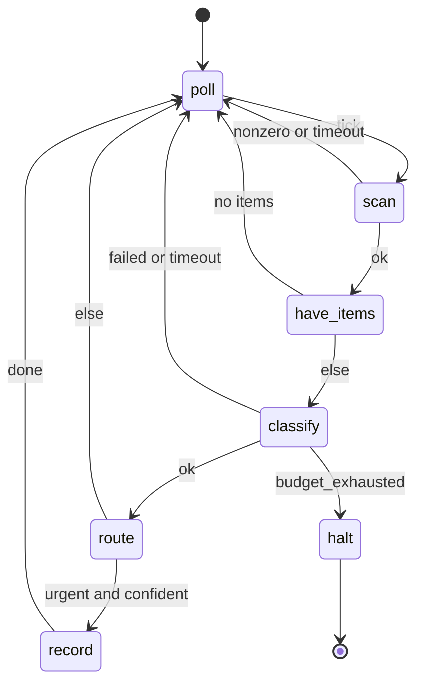

# Agent state machines

An agent state machine is a declarative, human-editable, machine-parseable program whose building blocks are agent6 runs, sandboxed tool calls, timed waits, and branches.
It lets an operator compose small deterministic agents that run for a long time, and agent6 is the runner.

This document specifies the format and its runtime.
The runtime lives under `src/agent6/machine/` (the engine and the format) with the lifecycles around it in `src/agent6/app/machine*`, driven by the `agent6 machine` subcommands: `list`, `create`, `check`, `test`, `graph`, `run`, `status`, `poke`, `stop`, and `replay` ([CLI surface](#7-cli-surface)).
It changes neither the security model nor the tool surface [AGENTS.md](https://github.com/agent6-dev/agent6/blob/master/AGENTS.md) binds; [Security considerations](#9-security-considerations) records how each invariant holds.

---

## 1. Motivation

`run` and `review` are single-shot.
A machine expresses the long-running shape: timed polling, branches on agent output, side-effecting steps, and terminal states.
Where "always-on" agents hand the LLM the *control flow* (so the same inputs take different paths and crashes lose state), here the operator authors the flow as a static graph and the LLM stays confined to the work *inside* a state: the deterministic snapshot-and-replay posture `run` already has internally, lifted one layer up.

---

## 2. Non-goals

- Not a general programming language
    - the branch/predicate grammar is non-Turing-complete: no loops inside a predicate, no arbitrary code
    - loops exist only as graph edges
- Not a distributed scheduler
    - one machine = one OS process (systemd / cron-friendly), restartable; no clustering in v1
- Not a new network surface
    - anything that talks to the outside world is a *tool*, gated by the existing audit rules
- Not LLM-authorized
    - `machine create` may draft a machine; in a repository `machine run` refuses the draft until the operator commits it

---

## 3. Design principles

- **Control flow is static and operator-owned; work is dynamic and model-owned**
    - the graph of states/edges is fixed at author time
    - inside an `agent` state runs the usual agent6 loop
- **Authored in a text editor**
    - TOML: diff-friendly, commentable
    - a state can *be* an agent6 run, so mini-agents are wired together rather than written in Python
- **Everything nondeterministic is journaled as a fact**
    - wall-clock reads, tool stdout, agent outputs: appended to an immutable event log the moment observed
    - the engine is a pure reducer over `(machine, blackboard, event) → blackboard'`
    - replay reads the journal instead of re-observing the world: a run backtests offline
- **Fail loudly** (repo convention)
    - one file parses to exactly one validated machine or a precise error
    - a missing transition target, an unreachable state, a blackboard type mismatch, an unknown key: load-time errors
- **No implicit defaults** (mirrors `Config`: `extra="forbid", frozen=True`)
    - every variable declares a type and an explicit initial value (`value` for `[vars.operator]`, `default` for mutable `[vars.code]`/`[vars.agent]`)
    - every state declares every outcome edge it can produce

---

## 4. The format

A machine is a single TOML file, suffix `.asm.toml` ("agent6 state machine").
TOML because the project already standardizes on it, `tomllib` parses it with no new dependency, and it is comfortable to hand-edit and diff.
The parsed document is validated by a pydantic v2 model at the trust boundary (`extra="forbid", frozen=True`), exactly like `Config`.

> **Naming.** The suffix `.asm.toml` ("agent state machine") is a convention, not a requirement: `load_machine` accepts any path, and shell completion globs `*.asm.toml`.

### 4.1 Top-level shape

```toml
machine = "item-classifier"                # stable id; names the instance dir
version = 1                                # schema version; bumped on changes
initial = "poll"                           # name of the entry state

[budget]
max_usd         = 25.0    # optional cap on metered spend (see below)
max_transitions = 100000  # hard stop on total edges taken (runaway guard)

# The blackboard is three subtables, named by who may write each variable.
# The subtable header is the owner; there is no per-entry discriminator.
[vars.operator]           # written at author time; immutable at runtime
inbox_dir = { type = "str", value = "/srv/inbox" }
poll_secs = { type = "int", value = 300 }

[vars.code]               # written deterministically by a tool state's capture
pending = { type = "list[str]", default = [] }
cursor  = { type = "str",       default = "" }

[vars.agent]              # written by an agent state's validated finish_session
verdict = { type = "classification", default = {} }  # a [schemas.*] record type

[schemas.<name>]          # named record types; see 4.6
...

[states.<name>]           # one table per state; see 4.3
...
```

### 4.2 The blackboard: three owners

The key/value store is split into three subtables, named by who may write each variable.
The subtable header carries the owner, so who may write a value is checkable at load time.

| subtable          | written by                                        | mutability        | declared with | example |
|-------------------|---------------------------------------------------|-------------------|---------------|---------|
| `[vars.operator]` | the human, at author time                         | immutable at runtime | `value`    | `inbox_dir`, `poll_secs`, thresholds, an API base |
| `[vars.code]`     | a `tool` state's `capture`                         | mutable (deterministic) | `default` | `pending`, `cursor` |
| `[vars.agent]`    | an `agent` state's validated `finish_session` payload | mutable (LLM)     | `default`     | `verdict` (a `[schemas.*]` record) |

Only `tool` states (into `[vars.code]`) and `agent` states (into `[vars.agent]`) ever mutate the blackboard; `branch`/`wait`/`terminal` only route, sleep, or end.

- **`[vars.operator]`**: the machine's parameters, set once at author/commit time, never written by any state
    - declared with a concrete `value` (not a `default`)
    - a `capture`/`set` targeting an operator var is a load-time error
    - any JSON-serializable value; the names above are illustrative
- **`[vars.code]`**: change only as a pure function of journaled tool output (what keeps the path deterministic and replayable)
- **`[vars.agent]`**: change only through the single validated structured output of one `agent` state (the LLM's one sanctioned channel into the blackboard)

`machine check` enforces the ownership wall.

- a `tool` capture targets only `[vars.code]`; an `agent` capture only `[vars.agent]`; `[vars.operator]` is read-only to every state
- a `tool` cannot smuggle a write into an LLM-owned variable; an agent cannot overwrite a deterministic one

Allowed types (all three subtables): `str`, `int`, `float`, `bool`, `list[<scalar>]`, `json`, and any **named record type** declared in `[schemas.*]` (see [Record schemas](#46-record-schemas-schemas)).
The two structured types differ on exactly one axis, **navigability**:

- `json` is an **opaque** blob: read or written wholesale only
    - passable to a tool/agent (`{{ x | json }}`) or captured whole, never dotted (`x.key` on `json` is a load-time error)
    - use it only when the machine never inspects the value's internals
- a **record type** (e.g. `classification`) is **navigable**
    - every `.field` read in a predicate or template checks against the schema at `machine check` time
    - a misspelled field is a load error, not a silent misroute

Declaring types up front is what makes branch predicates statically type-checkable: scalars by their declared type, record fields by their schema, and `json` forbidden from being dotted at all.

The blackboard (all three subtables) is the *only* state that flows between states.
The mutable halves (`[vars.code]` + `[vars.agent]`) are snapshotted to disk after every transition; `[vars.operator]` is fixed for the life of the machine.

### 4.3 State kinds

Every state has a `kind`.

| kind       | what it does                                              | outcome labels (edges)               |
|------------|-----------------------------------------------------------|--------------------------------------|
| `agent`    | runs one agent6 loop (a `Workflow`) on a prompt           | `ok` · `failed` · `budget_exhausted` · `timeout` |
| `tool`     | one sandboxed command via `run_in_jail`                   | `ok` · `nonzero` · `timeout`         |
| `wait`     | sleeps until a wall-clock tick or an external signal      | `tick` · `signal`                    |
| `branch`   | pure predicate over the blackboard → next state           | (chooses a `goto` directly)          |
| `terminal` | ends the machine                                          | (none; absorbing)                    |

- outcome labels are a fixed enum per kind, produced deterministically by the state executor
- a non-terminal, non-branch state declares `on = { ... }` mapping *every* label its kind can emit to a target; an omitted label is a load error
- the edge taken is a pure function of the closed label set, never of free-form LLM text

#### `agent`

```toml
[states.classify]
kind   = "agent"
model  = "inherit"               # the configured worker model, or pin one
prompt = """
Classify the item at path {{ cursor }}.
Call finish_session with JSON {label, confidence}.
"""
output_schema = "classification"   # a [schemas.*] entry; validates the payload
capture = { finish_json = "verdict" }   # payload -> blackboard var `verdict`
timeout_secs = 600
on = { ok = "route", failed = "poll", timeout = "poll", budget_exhausted = "halt" }

# mode = "agent"                   # "agent" (default, read-only) | "run"
# Optional per-state overrides (inherit the effective config when unset):
# provider = "anthropic"           # which [providers.*] entry backs this call
# effort = "high"                 # off | low | medium | high | xhigh | max
# temperature = 0.2
# max_usd = 1.5                    # this agent slice's metered-spend cap
# max_tokens_fallback = 100000     # ...and its unmetered-token cap (-1/0/>0)
```

An `agent` state spins up a normal agent6 run: its own snapshot dir, transcript, budget slice, jail.

- its only control-flow signal is the outcome label
- its structured product is the `finish_session` payload, validated against `output_schema`, captured into the blackboard
    - the state's task states the contract (the schema rendered field by field), and the loop refuses a non-conforming `finish_session` with the problems so the model retries in-run; the engine's own validation of the recorded payload stays the authority
- the LLM cannot pick the next state; it populates variables a downstream `branch` reads

`mode` chooses the tool surface.

- `"agent"` (default): a read-only, structured-output loop; the dispatcher refuses edit, `run_command`, `run_verify_command`, `read_session` and `fetch`, so the state can only read the repo and call `finish_session`
- `"run"`: real coding work (edit + verify + commit tools), exactly like `agent6 run`

Where a run state's work lands:

- each run state executes in a fresh clone (the `--parallel` lane mechanism, `[parallel].workdir` cache) checked out at the machine chain's tip
- its commits land per state on the visible `agent6/machine-<id>` branch; your checkout is never touched
- merge the branch when you want the work; a state's clone is removed as it lands, so nothing is left for `sessions prune` to sweep
- the branch outlives the instance dir: a fresh instance over a leftover `agent6/machine-<id>` refuses, naming the merge and delete remedies
- a machine with run states works its own tree everywhere: `tool` and read-only agent states also run in fresh clones at the chain tip, so an edit-then-check loop sees the committed work with no plumbing
- a `tool` state's tree writes are scratch, discarded with its clone; durable output goes to the blackboard or `$AGENT6_MACHINE_DATA_DIR`
- a machine with no run states runs its tool states in your checkout, unchanged
- states are sequential continuations of the branch (each starts from the previous state's tree); lanes are parallel alternatives cut at base
- a `mode = "run"` state still returns only its outcome label and `finish_session` payload
- `machine run` resolves a git commit identity up front (`[git.commit]` or the repo's git config) so the confined agent's commits succeed

`run_command` in any agent state is gated by `sandbox.run_commands`:

- under the default `ask`, an unattended machine auto-denies every call (`machine run` warns up front when a `mode = "run"` state would hit this)
- a machine spawned from the web or TUI hub parks each approval and question for the front-end (the spawn carries the detached `wait` away-mode), so the answer never depends on when the viewer attached
- grant per invocation with `--auto-approve` (ask upgrades to yes; a withheld `no` stays no), or set `sandbox.run_commands = "yes"` in the repo config
- a machine `[config]` overlay cannot grant it (sandbox policy is operator-only)
- edits and the auto-commit need no approval; `run_verify_command` and the `verify_when` certification share the same gate: prefer `tool` states over shelling out

The optional per-state knobs tune how that loop runs.

- `provider` / `effort` / `temperature` select and tune the model; `max_usd` / `max_tokens_fallback` bound this one agent slice
- each falls back through the effective config when omitted ([Machine config overlay](#47-machine-config-overlay-config))
- secrets are never expressed here, only a `provider` name that must exist in the effective config

#### `tool`

```toml
[states.scan]
kind = "tool"
command = ["scan-inbox", "--dir", "{{ inbox_dir }}", "--since", "{{ cursor }}"]
output_schema = "scan_result"          # types `result` so fields are navigable
capture = { set = { pending = "{{ result.pending }}", cursor = "{{ result.cursor }}" } }
timeout_secs = 60
on = { ok = "have_items", nonzero = "poll", timeout = "poll" }
```

A single command, argv-style (never a shell string), through the existing `run_in_jail`.

- `nonzero` is any non-zero exit
- stdout parses as JSON, bound to the capture-scope name `result` ([Names, references, and namespaces](#45-names-references-and-namespaces-normative))
- a capture binds only on `ok`: `nonzero` and `timeout` leave the blackboard as it was, so a branch reading a captured var on those edges reads the previous iteration's value
- capture has two modes; a state uses at most one:
    - **Opaque whole-capture**: `capture = { stdout_json = "<var>" }` binds the entire parsed stdout to one variable
        - no `output_schema` needed; `result` is opaque and may not be dotted
    - **Typed field-capture**: `output_schema = "<record>"` types `result`; pull fields with `set = { <var> = "{{ result.<field> }}" }`
        - every `result.<field>` is statically checked, mirroring how an `agent` state validates `finish_session`

- a `list`-typed variable spliced as a bare argv element (`"{{ pending }}"`) expands to one argument per element, and an EMPTY list contributes no argument at all ([Templating and list-splicing](#44-templating-and-list-splicing))
- `scan-inbox` is an illustrative stand-in: a `tool` state runs whatever audited command the operator names

**Network (opt-in, host network off by default).**

- a `tool`'s `network`: `"auto"` (default: its own network where the host can give one, degrading to the host's with a warning on `hardened`), `"none"` (the same, required: refuses on `hardened`, which cannot isolate a single tool), `"host"`
- only `network = "host"` reaches the host network
- the engine is a host-netns supervisor (each `agent` state is its own subprocess; [Security considerations](#9-security-considerations)), so one opt-in `tool` can be networked while every other jailed command stays offline
- a `tool` command is fixed and operator-reviewed: not the free exfiltration channel a networked `run_command` would be
- honoring the opt-in is the operator's call via `sandbox.network` (global/repo config, never the machine overlay):

| `sandbox.network` | jailed commands | `tool` w/ `network="host"` |
|---|---|---|
| `auto` *(def)* | no host network on `strict` | ⛔ refuse to run |
| `session` | the same (refuses on `hardened`) | ⛔ refuse to run |
| `only_explicit_states` | no host network | **host network** |
| `host` | host network | host network (and `run_command`) |

- the headline setup (offline commands + one networked reviewed tool): `sandbox.network = "only_explicit_states"` + `network = "host"` on that state
- `only_explicit_states` and `session` need `strict`; an unhonorable tool-network config refuses at startup, naming the conflicting `sandbox.network` value and the fix
- offline tool states each get their own network (separate launchers; no run-wide session network to share)

**Script bundles.** A machine is a bundle: the `.asm.toml` plus an optional sibling `scripts/` of operator-reviewed helpers (the kind `machine create` may draft).

- a `tool` references one by a relative path starting `scripts/` (`command = ["bash", "scripts/fetch.sh"]`), resolved against the jail's mounted cwd: keep the bundle at or under the directory you run `agent6` from
- a bare binary in `command[0]` resolves against the jail PATH (the set `machine check` probes and `run_command` uses), never the host `PATH`; absolute paths for anything elsewhere
- `machine check` validates the bundle: every `scripts/` entry and static command reference resolves inside it (escaping symlinks rejected)
- `strict`: the bundle is RO-bound in every jail; a tool or agent cannot rewrite its own machine logic mid-run
- `hardened`: the cwd is blanket read-write (no mount namespace to carve); the surrounding container bounds the damage

Cross-iteration persistence: `$AGENT6_MACHINE_DATA_DIR`.

- a per-machine writable dir under the per-repo state dir (`<state-dir>/<repo-id>/machines/<id>/data/`, out of the workspace), RW in every tool jail
- under `hardened` the repo cwd is also read-write; the data dir is the durable home either way, and the journal records every transition

#### `wait`

```toml
[states.poll]
kind = "wait"
every_secs = "{{ poll_secs }}"   # at most one of: every_secs | until
on = { tick = "scan", signal = "scan" }
```

`wait` is what makes a machine long-running without burning CPU or tokens.

- at most one of `every_secs` or `until` (an absolute ISO-8601 instant); both is a load error
- on entry the engine journals the absolute next-wake instant *before* sleeping: replay re-reads it and never sleeps
- v1 blocks in-process until the instant or an external `signal` (a file/IPC poke)
- the wake being journaled absolutely lets the `--exit-on-wait` persisted-wake driver ([Reliability](#6-reliability-for-247-operation)) run the identical file, no format change

**Wait-forever (no timer).** Declare *zero* timers to park indefinitely until an operator `signal` poke:

```toml
[states.park]
kind = "wait"
on = { signal = "handle" }        # no timer: a forever wait declares `signal`
```

- a no-timer wait can never `tick`: it declares only `signal` (a `tick` edge is a load error, unreachable)
- under `--exit-on-wait` the engine persists a signal-only pending wait (no wake instant) and resumes when poked

**Poke payloads.** `agent6 machine poke <id> [--data <json> | --message <text>]` carries an optional payload to the waking `wait`.

- one signal pending at a time: a second poke replaces the first, payload included (a wake, never a queue)
- the payload is journaled on the `signal` `WaitFact` (replay-safe) and materialized to `$AGENT6_MACHINE_DATA_DIR/poke.json` for the next `tool`
- no capture on `wait`: the payload flows through the existing tool -> capture -> branch pattern
- on replay the journaled payload reproduces the identical input

#### `branch`

```toml
[states.route]
kind = "branch"
when = [
  { if = "verdict.label == 'urgent' and verdict.confidence >= 0.7", goto = "record" },
  { else = true, goto = "poll" },
]
```

- `when` is ordered; the first matching `if` wins; a final `else = true` is required (total function, no stuck state)
- the predicate grammar is restricted and non-Turing-complete ([Execution semantics](#5-execution-semantics)): comparisons, `and`/`or`/`not`, membership, `len()`, `has()`, literals, blackboard references
- `has()` tests presence: the guard an `optional` record field needs before a read (`has(out.score) and out.score > 0` is safe; `and` short-circuits)
- no function calls beyond the fixed allow-list, no Python attribute access, no `eval`
- dotted references (`verdict.confidence`) are data navigation by agent6's own evaluator, never Python attribute resolution
- a hard security boundary: a `.asm.toml` must never execute arbitrary code

#### `terminal`

```toml
[states.halt]
kind   = "terminal"
status = "failed"        # "ok" | "failed"
reason = "machine budget exhausted"
```

- absorbing: emits `machine.end` and returns control to the CLI
- a machine may have many terminal states (success and failure variants)

#### `notify` (any state)

Any state may carry an optional `notify`, a templated message emitted on entry:

```toml
[states.escalate]
kind = "wait"
notify = "needs a human: {{ reason }}"        # or a table with a level
on = { signal = "resume" }

[states.done]
kind = "terminal"
notify = { message = "run finished", level = "info" }   # info | warn | error
status = "ok"
reason = "done"
```

- entering the state journals a `machine.notify` event (message + level) and fires the operator notify hook
- presentation only: no edge, no control-flow effect, no blackboard write
- `machine.end` is also a notify trigger, so a terminal need not set `notify` to be surfaced
- the message is a blackboard template, checked at `machine check`
- a `wait` state emits once per park: the armed wake record is the machine's memory that it already entered, so a resume that re-enters mid-park does not page the operator again. Every other state kind re-emits on a resume that re-enters it

Two channels render it; agent6 owns no push infrastructure:

- device-present front-ends (`agent6 web`, the TUI Machines page, `agent6 attach`): an ephemeral notification
- out-of-band: `[machine.notify].on_event` ([config.md](config.md)), an operator argv on the host, outside the jail, on every `machine.notify` and `machine.end` (fan out to ntfy/Pushover/email/Telegram)

### 4.4 Templating and list-splicing

Strings may contain `{{ ... }}` interpolations.

- an interpolation is one reference plus at most one filter, nothing more
- no arbitrary expressions, no chained filters, no method calls; anything richer belongs in a `branch` predicate (itself restricted)
- this keeps validation and replay simple, and the format from quietly becoming a scripting language

There are exactly two filters, both zero-argument:

| filter | applies to | result |
|--------|------------|--------|
| `len`  | `str`, `list`, or a `json`/record container | the integer length |
| `json` | any value | compact JSON, object keys sorted (deterministic) |

- deliberately no `join` filter: a delimited string a command must re-split is fragile and injection-prone; lists reach argv by **splicing** (below)
- an interpolation renders to a string, except a lone filter-less `{{ ref }}` in `capture.set`, which assigns the referenced value with its own type (it must match the target's declared type)
- elsewhere a bare `{{ x }}` is legal only for a scalar (`str`/`int`/`float`/`bool`); a bare `list`/`json`/record reference is a load error (apply `json`, or splice a list in argv)

**List-splicing (argv only).**

- a `command` element that is exactly `"{{ listvar }}"` (lone list reference, no filter, no surrounding text) expands to one argv element per item
- an empty list contributes NO argument, so the command runs one element shorter: guard it with a `branch` on `len(x)` where that changes the command's meaning
- the only way a list crosses into a command; injection-safe (each element stays a distinct argument, never shell-re-parsed)
- two load errors guard it: splicing a non-list, and embedding `{{ listvar }}` inside a larger string (`"--x={{ items }}"`)
- filter and reference grammar are validated at `machine check`

### 4.5 Names, references, and namespaces (normative)

Every rule about how variables are named, written, and read, so one machine file has exactly one meaning.
Every rule here is enforced by `agent6 machine check` and re-checked before `machine run`; each violation is a *load-time* error, never a silent runtime surprise.

**Identifier grammar.** A *variable name* and a *state name* each match `^[a-z][a-z0-9_]*$` (ASCII snake_case).
TOML quoted/dotted keys that would smuggle other characters (`"last-seen"`, `"a.b"`) are a load error.
The restriction exists because variable names appear as bare `Name` tokens in predicates (parsed by `ast.parse`); a non-identifier could not be one.

**Three owners, one flat reference namespace.** The `[vars.operator]`, `[vars.code]`, and `[vars.agent]` subtables decide *who may write* a variable.
They do not create three separate read namespaces.
Every variable is referenced everywhere (templates and predicates alike) by its bare name only: `positions`, never `vars.code.positions` and never `code.positions`.
The owner prefix never appears in a reference.

Three consequences, each a `machine check` error:

- **Global uniqueness across owners.** A name may be declared in exactly one of the three subtables.
  Declaring `positions` in both `[vars.code]` and `[vars.agent]` is rejected: *"variable `positions` declared in both `[vars.code]` and `[vars.agent]`; the three owner subtables share one read namespace"*.
  A bare reference is forbidden rather than resolved by precedence.
- **No bare top-level vars.** Every variable must live under one of the three owner subtables.
  A key written directly under `[vars]` (i.e. `vars.positions`) has no declared owner and is rejected: *"`vars.positions` has no owner subtable; put it in `[vars.operator]`, `[vars.code]`, or `[vars.agent]`"*.
  It is never silently ignored.
- **Reserved names.** The bare names `vars`, `operator`, `code`, `agent`, and `result` may not be used as variable names.
  `result` is reserved for capture scope (below); the rest are reserved so a reference can never be read as an owner path.

**Reference grammar (one grammar, used identically in predicates and templates).**

```
ref  := name ("." key)*
name := an identifier declared in exactly one [vars.*] subtable
key  := an identifier (a declared field of a record type)
```

- the first segment is a declared variable; the validator checks it exists
- further `.key` segments are ordered dictionary lookups by agent6's own evaluator: never Python attribute access, never `getattr`
- a `.key` is legal only into a record type ([Record schemas](#46-record-schemas-schemas)); each segment checks against the schema at load (a misspelled field is a load error)
- dotting an opaque `json` or a scalar is a load error: `json` is wholesale-only, which keeps every navigable path statically checkable

**Capture scope and `result`.**

- inside a state's `capture` table, the reserved `result` denotes the structured output the state just produced, visible only there
- not a blackboard variable, not declarable, invisible outside the capturing state
- dottable only when typed by an `output_schema` record (mandatory for `agent` states; optional for `tool` states, which are otherwise whole-capture only)

A `capture` has two forms of target:

- a fixed source key (`stdout_json` for `tool`, `finish_json` for `agent`) naming one blackboard variable to receive the whole output;
- a `set = { <var> = "<template>" }` table assigning rendered templates (which may read `result`/`result.<field>`) to blackboard variables.

- what a capture may write is the ownership wall: `tool` -> `[vars.code]` only, `agent` -> `[vars.agent]` only; a `[vars.operator]` or undeclared target is a load error
- the captured value's runtime type must match the target's declared type, or the machine halts loudly

**State-name namespace.**

- state names are a separate namespace from variables: referenced only by `initial`, `goto`, and `on`, never in predicates or templates (a state and a variable may share a name)
- every `goto`/`on` target names a declared state; every declared state is reachable from `initial` (each a load error otherwise)

### 4.6 Record schemas (`[schemas.*]`)

A **record type** is a named, field-typed structure declared once under `[schemas.<name>]`.

- used as a variable's `type` (navigability) and as an `agent` state's `output_schema` (payload validation at the trust boundary)
- one mechanism for both: exactly one way to describe structured data
- the schema language is tiny: inline TOML, no JSON Schema, no new dependency (`tomllib` + `pydantic`)
- each entry is `field = "<type>"` or `field = { type = "<type>", ... }`:

```toml
[schemas.classification]
label      = { type = "str", enum = ["urgent", "normal", "spam"] }
confidence = "float"
note       = { type = "str", optional = true }
```

Rules (all enforced at `machine check`):

| Rule | Behavior |
|---|---|
| **Field types** | `str`, `int`, `float`, `bool`, `list[<scalar>]`, another **schema name** (recursive; cycles are a load error), or `json` (opaque escape hatch; itself not dottable, [The blackboard](#42-the-blackboard-three-owners)) |
| **Required by default** | every field must be present in a validated payload unless `optional = true` (mirrors `Config`'s `extra="forbid"`); unknown fields are rejected. An absent optional field is absent, not null: reading it unguarded is a runtime halt, `has()` is its predicate guard, and `machine test` exercises absence (dry-run synthesizes required fields only) |
| **`enum`** | string fields only; constrains a `str` to a fixed literal list, checked at the `finish_session`/capture boundary (earlier than a `branch` would re-check it) |
| **Dotting** | a `.field` in a predicate/template is type-checked against the schema (field must exist); a `list`/`json`/non-record field may not be dotted further |

### 4.7 Machine config overlay (`[config]`)

A machine file may carry an optional top-level `[config]` table: an agent6 config fragment layered on the effective config for the run.

- the stack: defaults < global < repo < `--config FILE` < the machine overlay (highest)
- most knobs `agent6 config show` lists are valid inside it; the refusals are below

```toml
[config.workflow]
verify_command = ["uv", "run", "pytest", "-q"]

[config.review]
trigger = "on_verify_fail"

[config.budget]
max_usd = 50.0
```

Unset keys read straight through to the lower layers, so a machine only states what it wants to change.
Two hard rules:

- **No connections/secrets, no sandbox policy, no presets, no MCP servers, no host hooks**
    - `[config.providers.*]`, `[config.sandbox.*]`, `[config.presets.*]`, `[config.mcp.*]`, a top-level `preset`, `[config.agent6].state_dir`, `git.run_repo_hooks`, `git.run_repo_filters`, `machine.notify`, `notify.on_complete`, `prompt.system_prompt_file`: each a load-time error
    - endpoints, key-env names, and secrets live in the global config / secrets store; sandbox policy, presets, MCP servers, and host-argv hooks are operator decisions in the global/repo config
    - a machine file may be LLM-drafted or shared: it must not widen its own egress, weaken its jail, or run host code through the overlay, directly or via a preset the operator's selection would resolve
    - the overlay only routes to a provider name that already exists, and sets benign knobs (commit identity)
- Per-`agent`-state knobs ([State kinds](#43-state-kinds)) override the overlay for that one state
    - agent-loop precedence: per-state knob > machine `[config]` > repo > global > built-in default

---

## 5. Execution semantics

### 5.1 The engine as a pure reducer

```
load(file) -> Machine            # pydantic, extra=forbid, frozen
blackboard = Machine.initial_vars()
state = Machine.initial
loop:
    event   = execute(state, blackboard)     # the only impure step
    journal.append(event)                    # append-only, fsync
    blackboard = reduce(blackboard, event)   # pure
    state   = next_state(Machine, state, event, blackboard)  # pure
    snapshot(state, blackboard)              # atomic temp+rename
    if state is terminal: break
```

- `execute` is the only place the world is touched (run an agent, run a tool, read the clock)
- its result journals as a fact *before* the blackboard updates; `reduce` and `next_state` are pure
- replaying the journal reproduces the exact path, branches included (the outputs a branch reads are in the journal)

### 5.2 Determinism guarantees and the predicate evaluator

- Branch edges are pure functions of the blackboard; the blackboard is a pure function of journaled events; no branch depends on un-logged state
- The predicate evaluator is a hand-written recursive walk over a small AST
    - `ast.parse(..., mode="eval")`, then a strict node allow-list: `Compare`, `BoolOp`, `UnaryOp`, `Name`, `Constant`, a fixed-name `Call` list, and `Attribute` reinterpreted as record data navigation, never Python attribute access
    - anything outside the allow-list raises at `machine check`
    - it parses but never calls `eval`, `exec`, or `getattr`; an `Attribute` chain walks the blackboard dict, a `Name` must be declared, any other free name is a load error
- Wall-clock, randomness, and external reads are captured as facts
    - `agent6 machine replay <machine-id>` feeds the recorded facts instead of touching the world: a completed run replays to the identical path offline

### 5.3 Persistence layout

Mirrors the existing per-run layout under the per-repo state dir, out of the workspace:

```
<state-dir>/<repo-id>/machines/<machine-id>/
  machine.asm.toml           # the exact source the run started from (replay, status)
  journal.jsonl              # append-only, fsync'd, one event per line
  snapshots/<n>.json         # blackboard + current state, atomic temp+rename
  agent_transcripts/<utc-iso>-<seq>.json  # one lossless request/response per file
  states/<seq>-<state>/logs.jsonl  # per-execution event stream (role.*/tool.*),
                                   #   the watchable live view; pruned to recent
  states/<seq>-<state>/approvals/, questions/  # that execution's answer bridge
                                   #   (`<id>.answer` from a front-end), steer files beside them
  data/                      # writable scratch ($AGENT6_MACHINE_DATA_DIR)
  machine.lock               # single-writer guard (one process per machine)
  worker.pid                 # the live worker; absent or stale once it exits
  wait.json                  # the armed wait (state, next wake), written before a
                             #   wait sleeps or parks, cleared when it fires
  signal                     # a poke awaiting the wait's next check (payload inside)
  signal.consuming           # a claimed poke, until the wake's step is acked
  stop                       # a stop request awaiting the next transition boundary
  frontends/<pid>            # live front-end claims (a TUI or web watcher)
  approvals/away.mode        # a hub-spawned instance's away mode ("wait")
```

- each `agent` state execution emits a `logs.jsonl` stream under `states/<seq>-<state>/` (the same `role.*_delta` / `tool.*` events a run emits): a running machine follows live exactly like a run
- the heavy per-state logs prune to the most recent `state_log_keep` (default 50); the journal stays the complete transition history

Sizing for long-running machines:

- the journal grows ~one line (~200 B) per transition; a 10-minute-interval machine makes ~150k transitions a year (3 per idle tick), tens of MB
- snapshots keep only the most recent `[machine] snapshot_keep` (default 5, `0` = all); replay from the journal is bounded by that tail
- per-state reasoning logs grow with agent-state executions only, and self-prune
- the journal has no rotation: archive or delete an instance dir when replay no longer needs it; `[budget] max_transitions` is the primary runaway guard

### 5.4 Idempotency and crash recovery

- a state runs, then exactly one fsync'd `StepEvent` records its outcome and captured fact: the commit point
- the capture validates *before* the StepEvent writes, so the journal never holds a fact a later `reduce` could not replay: a tool's malformed stdout halts the machine loudly, and an agent's non-conforming `finish_session` is refused in-run (the model retries; a leg that never conforms lands outcome `failed` and routes on that edge)
- on restart the engine rehydrates from the last StepEvent and continues
- the crash window is side-effect-done to StepEvent-on-disk: a kill there loses the fact and the step re-runs on resume
- the posture is at-least-once: a `tool` with an external side effect must be idempotent (the examples move a file or write `$AGENT6_MACHINE_DATA_DIR`, so a re-run is a no-op)
- the journal is crash-tolerant: a torn final line drops on read and heals on the next append; a corrupt newest snapshot falls back to the retained tail

---

## 6. Reliability for 24/7 operation

- **Restartable, not resident**
    - a `wait` blocks in-process or persists the next wake and exits 0, re-armed by a systemd timer / cron
    - the journal is the source of truth either way: a reboot loses nothing
- **Runaway guards**
    - `[budget]` USD and `[budget].max_transitions` stop the machine when crossed
    - a no-wait, no-spend loop is still bounded by `max_transitions`
- **Single writer**: `machine.lock` (flock) guarantees one process per machine id; a second invocation refuses
- **Health/visibility**
    - `machine status <id>`: current state, blackboard, last N events, spend, next wake
    - `agent6 attach <id>`: the unified watcher, live (state overview, each transition, the active agent state's reasoning)
    - the TUI Machines page wraps the same view (**Run** opens it; **Watch** `w` attaches)
    - `machine graph <file>`: mermaid or Graphviz DOT (`--format`)

---

## 7. CLI surface

| command                                   | effect                                            |
|-------------------------------------------|---------------------------------------------------|
| `agent6 machine create <task> [-o <file>] [--max-attempts N]`| LLM-drafted bundle: `.asm.toml` + every `scripts/...` file + a mock test per script (external seam), written into a drafting workspace of its own; per-draft gate: `machine check`, ruff, ty, mock tests in a no-network jail; failures hand the problems back (`--max-attempts`, default 3); output: a DRAFT for operator review + commit ([Security considerations](#9-security-considerations)) |
| `agent6 machine check <file>`             | validate: the `[config]` overlay against the config schema (and its refusals); parse; type-check vars; every edge target exists; every state reachable; every `branch` total; names unique across owners, each owned by a subtable; every reference declared; every `capture` inside the ownership wall; `len()` args and `wait` timings well-typed; the script bundle contained; script health (ruff + ty, config from the nearest `pyproject.toml`/`ruff.toml` above the file); no execution, no network |
| `agent6 machine test <file> [--blackboard FIXTURE.toml]` | everything `check` does; the bundle's `scripts/*_test.py` mock tests in a no-network jail; a pure dry-run (no provider, no clock): per state, synthesize the success fact, push through the real `reduce`, confirm capture binds and the label routes; per `branch`, evaluate each `when` against defaults + `--blackboard`, print the winning `goto`; the full offline simulation, every seam mocked |
| `agent6 machine graph <file> [--format mermaid\|dot]` | emit the machine as a diagram. `mermaid` (default) prints `stateDiagram-v2`; `dot` prints Graphviz DOT for `dot -Tsvg`/`dot -Tpng` and the broader Graphviz/`xdot` ecosystem. Reachability is already computed at load, so both are pure renders of the same validated graph. |
| `agent6 machine run <file> [--exit-on-wait] [--auto-approve\|--no-commands] [--dangerously-disable-sandbox]` | start (or resume) a machine. Acquires the lock, drives the loop. With `--exit-on-wait`, persist the next wake and exit 0 (status `waiting`) at the first not-ready `wait`, for an external scheduler (systemd timer / cron) to resume. The approval and sandbox flags are the run flags, for the same reasons and with the same refusals. |
| `agent6 machine status <id>`              | current state, blackboard, spend, next wake. Read-only. |
| `agent6 machine` (`machine list`)         | this repo's machines: each instance's status and current state joined with the authored `.asm.toml` that declares it, then the authored files no instance has run (spec validity per file). Read-only. |
| `agent6 attach <id>`                       | follow a running instance live (the unified watcher; the same command follows a run): state overview + current state, each transition as it lands, and the active agent state's reasoning (its per-state `logs.jsonl`). Read-only; Ctrl-C to stop. `agent6 attach --tui <id>` opens the machine screen, where a running agent state takes a steer (`s`), as the web machine page does. |
| `agent6 machine poke <id> [--data <json>\|--message <text>]` | signal a waiting instance to wake on its next check; an optional payload reaches the next `tool` at `$AGENT6_MACHINE_DATA_DIR/poke.json` (journaled, replay-safe). |
| `agent6 machine stop <id>`                | park at the next transition boundary: a durable marker, not a kill; wakes a sleeping `wait`, leaving it armed; no `MachineEnd` journaled (resumes with `machine run`); ended/not-running refused; also on the web machine page and the TUI machine screen (`x`) |
| `agent6 machine replay <id>`              | deterministic replay from the journal (no world I/O); backtesting. |
| `agent6 config set/get/fix --machine-file FILE` | read and write the machine's own `[config]` overlay through the config surfaces, with the same refusals as hand-editing it. |

`machine check` is the human-editability payoff: precise, fail-loud diagnostics (``state 'act': branch is not total (no final `else`)``), and a warning when a `tool` state's binary is not on the jail's PATH.

### 7.1 `machine create`

Describe a loop in plain language and get a first-cut bundle back.
It is an ordinary agent6 run handed this document's grammar, working in a drafting workspace of its own: the model writes the `.asm.toml` and every `scripts/...` file there with `apply_edit`, one file at a time, and finishes when the bundle is complete.
No new tool. The leg has the edit tools; `run_commands = "no"` withholds `run_command`, `run_verify_command` and `stop_background`, the operator's `[workflow].metric` is dropped so `run_metric_command` has nothing to run, and no host is pre-allowed so a headless `fetch` denies. It never sees the operator's checkout, and its writes are bounded by the workspace the way any run's are by its repo.

- the workspace is an empty git repo under `[parallel].workdir` (where lane clones and fork worktrees live), so each iteration commits and the draft survives a failure for the operator to read
- every draft is gated: `machine check`, ruff (the destination's ruff config), ty, mock tests in a no-network jail
    - agent6 runs those validators itself between attempts (they need agent6, which no jailed command can reach) and hands the problems back, up to `--max-attempts` (default 3); the agent patches the files it wrote
- the result is a draft: `-o <file>` overwrites freely, else `<name>.asm.toml` in the cwd, never clobbered (a collision prints to stdout, exits non-zero)
    - scripts land in `scripts/`
- each attempt is watchable: a draft dir under the state dir carries the prompt, the transcript, and a `logs.jsonl` the TUI/web follow live
    - the CLI streams in the foreground; the TUI and web start detached and follow the dir
- the [Security considerations](#9-security-considerations) invariant holds: `create` drafts into the working tree only; the operator reviews and commits; `machine run` refuses an uncommitted bundle

---

## 8. Module boundaries

The layering is `ui → app → workflows → tools → sandbox`, with `agent6.machine` a top-level package beside them, and workflows never import each other.
An `agent` state needs to *invoke* the `loop` workflow, so the engine cannot itself be a `workflow` without breaking that rule.

The engine does not import the workflow stack.
Rather than constructing a `Workflow` itself, `engine.drive` runs an `agent` state through an injected `agent_runner` callable (`Callable[[AgentRequest, Path | None], AgentExecResult]`, the second argument being the per-state event-log path (`<instance>/states/<seq>-<state>/logs.jsonl`) each agent-state execution streams to).
`app/`, which already depends on both `agent6.machine` and `agent6.workflows`, builds that runner and the orchestration around `machine create`/`run` (`app/machine_agent.py`, `app/machine/`), with `ui/cli` adapting argv and rendering, so `agent6.machine` never gains an edge into `agent6.workflows` and the tach graph stays acyclic.

Files (all `from __future__ import annotations`, strict pyright, pydantic only at the parse boundary, `@dataclass(frozen=True, slots=True)` for the internal value types):

- `machine/model.py`: pydantic `MachineSpec`/state/var specs (the parse boundary).
- `machine/_semantics.py`: semantic validation and `finish_session` payload validation.
- `machine/dryrun.py`: the pure, no-I/O dry-run behind `agent6 machine test`.
- `machine/predicate.py`: the allow-list AST predicate evaluator.
- `machine/template.py`: the single interpolation/splicing engine shared by the validator and the runtime.
- `machine/graph.py`: the mermaid/DOT renderers.
- `machine/journal.py`: append-only event log, snapshots, locking, and persisted-wake state.
- `machine/engine.py`: the deterministic reducer loop.
- `machine/authoring.py`: the dependency-free prompt scaffolding for `machine create` (grammar guide, per-attempt prompt builder).

No new runtime dependency (`tomllib` + `pydantic` + stdlib `ast`).

---

## 9. Security considerations

- **No new LLM tool surface**
    - the fixed set in `tools/schema.py` is unchanged; machines orchestrate existing capabilities
    - `machine create` is no exception: the drafting agent has the same edit tools any run has, pointed at a drafting workspace of its own, with every command tool withheld and its own `[workflow].metric` and `fetch` reach removed
- **No arbitrary code execution from a file**
    - predicates and templates are parsed-then-walked against an allow-list; never `eval`/`exec`, never `getattr`
    - dotted references are agent6-interpreted data navigation, not Python attribute resolution
    - a `.asm.toml` is data, not code
- **All side effects stay jailed**
    - `tool` states go through `run_in_jail`; each `agent` state is an ordinary run in its own subprocess, commands jailed like any run's
    - `mode = "run"` machines never touch the operator's checkout: fresh clones per state, commits on `agent6/machine-<id>`, tool-state tree writes discarded with the clone
    - per-state network and refusals: [security.md, Network](security.md#5-network)
- **Spend bounds**
    - `[budget].max_transitions` is required and always binds
    - `max_usd` (optional) caps cumulative metered spend; an unpriced model is bounded per state by `[budget].max_tokens_fallback` (`0` refuses unmetered models outright)
    - a supervisor crash mid-state cannot re-grant its slice: the resume books the orphaned per-state totals as an `attempt.spend` journal event, counted everywhere
- **Machines are operator artifacts, never LLM-authored**
    - the threat model assumes the file is operator-written and reviewed like code; an LLM may propose (`machine create` drafts), running requires operator review + commit
    - `create` writes into its own workspace, publishes one reviewed bundle into the working tree, and never auto-runs
    - `run` operates on a committed bundle, records it under the instance dir at first run, and refuses a continuation whose bundle drifted from the recorded bytes
    - a live instance runs the logic it recorded; an edit takes effect on a new instance
    - drafting is assistance; authorization stays human
- **External-world tools remain out of scope**
    - adding a tool that reaches the network or an external service is a separate change: the `tools/schema.py` security-review note plus a network/jail audit
    - the examples here use illustrative stand-in tools only

---

## 10. Worked example

```toml
# item-classifier.asm.toml (illustrative). scan-inbox/archive-item are
# stand-in audited tools, not part of agent6; they only show the *shape*.
machine = "item-classifier"
version = 1
initial = "poll"

[budget]
max_usd         = 25.0
max_transitions = 100000

[vars.operator]                   # operator inputs, fixed for the machine's life
inbox_dir = { type = "str", value = "/srv/inbox" }
poll_secs = { type = "int", value = 300 }

[vars.code]                       # set deterministically by a tool capture
pending = { type = "list[str]", default = [] }  # set by the scan tool
cursor  = { type = "str",       default = "" }  # set by the scan tool

[vars.agent]                      # set by an agent state's finish_session
verdict = { type = "classification", default = {} }  # set by classify

[schemas.classification]          # validates the agent's finish_session payload
label      = { type = "str", enum = ["urgent", "normal", "spam"] }
confidence = "float"

[schemas.scan_result]             # types the scan tool's stdout
pending = "list[str]"
cursor  = "str"

[states.poll]
kind = "wait"
every_secs = "{{ poll_secs }}"    # at most one of every_secs | until
on = { tick = "scan", signal = "scan" }

[states.scan]
kind = "tool"
command = ["scan-inbox", "--dir", "{{ inbox_dir }}", "--since", "{{ cursor }}"]
output_schema = "scan_result"
capture = { set = { pending = "{{ result.pending }}", cursor = "{{ result.cursor }}" } }
timeout_secs = 60
on = { ok = "have_items", nonzero = "poll", timeout = "poll" }

[states.have_items]
kind = "branch"
when = [
  { if = "len(pending) == 0", goto = "poll" },
  { else = true,              goto = "classify" },
]

[states.classify]
kind   = "agent"
prompt = """
Classify these pending items: {{ pending | json }}
Call finish_session with JSON {label:"urgent"|"normal"|"spam", confidence:0..1}.
"""
output_schema = "classification"
capture = { finish_json = "verdict" }
timeout_secs = 600
on = { ok = "route", failed = "poll", timeout = "poll", budget_exhausted = "halt" }

[states.route]
kind = "branch"
when = [
  { if = "verdict.label == 'urgent' and verdict.confidence >= 0.7", goto = "record" },
  { else = true, goto = "poll" },
]

[states.record]
kind = "tool"
# `{{ pending }}` is a lone list reference -> spliced to one argv element per item
command = ["archive-item", "--label", "{{ verdict.label }}", "{{ pending }}"]
timeout_secs = 30
on = { ok = "poll", nonzero = "poll", timeout = "poll" }

[states.halt]
kind   = "terminal"
status = "failed"
reason = "machine budget exhausted"
```

Control flow, condensed.
`agent6 machine graph` prints the same shape with one edge per transition and each `on` key verbatim:



---

## 11. Resolved decisions

- **`wait` runtime**: an absolute next-wake instant is journaled; v1 blocks in-process ([State kinds](#43-state-kinds), [Reliability](#6-reliability-for-247-operation))
    - a persisted-wake/systemd driver runs the identical file later
    - a zero-timer `wait` parks until a `signal` poke; the payload journals and materializes to `poke.json`
- **Schema language**: inline `[schemas.*]` TOML ([Record schemas](#46-record-schemas-schemas)), not JSON Schema; no new dependency, human-editable, one mechanism for both `output_schema` validation and navigable record vars.
- **`agent` writes**: exactly one validated `finish_session` payload per `agent` state is the LLM's only write channel ([The blackboard](#42-the-blackboard-three-owners)); multiple outputs are fields of one record.
- **Concurrency**: strictly sequential, one active state; compose by running independent machines (`fork`/`join` may come later)
- **`json` navigability**: opaque `json` is wholesale-only; anything navigated with `.field` must be a declared record type ([Record schemas](#46-record-schemas-schemas)), so every path is statically checkable.
- **List → argv**: no `join` filter; a lone `"{{ listvar }}"` argv element is spliced to one element per item ([Templating and list-splicing](#44-templating-and-list-splicing)).
- **Naming**: subcommand `machine`; suffix `.asm.toml` ([The format](#4-the-format)).
